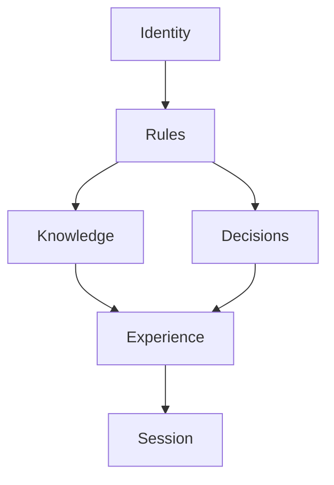
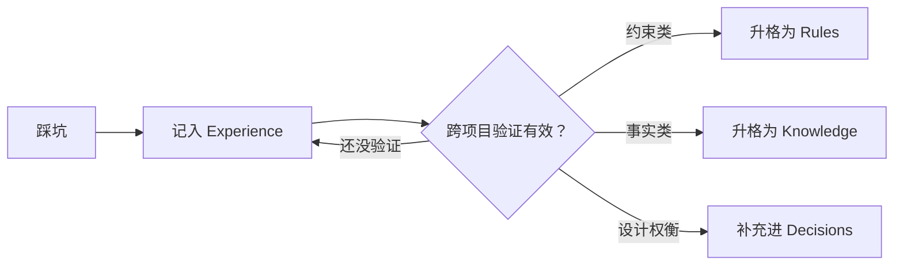

> **定位**：一套让 Agent 长期记忆有章可循的分层框架——回答"什么该记住、什么该忘、什么该更新"。

## 一、一句话总结

Agent 的记忆管理，说到底就三件事：**该记住的进文件，该丢的留在对话里，验证过的才升级。**

把记忆分成六层——Identity（身份）、Rules（规则）、Knowledge（知识）、Decisions（决策）、Experience（经验）、Session（会话）——每层回答不同的问题、生命周期长短不一，所以写法和维护频率也不该一样。分层不是为了给 Agent 贴标签，而是让每条信息有明确归属，避免"什么都记，什么都没记住"。

## 二、为什么需要分层

上下文窗口不是越大越好。Anthropic 在 [《Effective context engineering for AI agents》](https://www.anthropic.com/engineering/effective-context-engineering-for-ai-agents) 里提过一个现象——**context rot（上下文腐烂）**：上下文越长，模型注意力越涣散，检索关键信息的准确率反而下降。把记忆全塞进上下文，等于用注意力换容量，越存越亏。

不分层的后果，我在实践里见过三类：

1. **身份散落**——每次会话都要重新对齐"你是谁、什么风格、边界在哪"，每次都从零开始。
2. **规则被经验冲淡**——真正必须守的硬规则和踩坑心得混在一起，"必须"两个字逐渐失去力气。
3. **临时挤占长期**——本次任务的琐碎细节赖在长期记忆里不走，长期有效的信息反而放不下。

我一开始觉得分层是过度设计——Agent 不就是"一个上下文加一个文件系统"吗？直到这三种情况在真实项目里反复出现，才明白问题不在容量，而在**信息没有归属**。

## 三、六层模型

| 层 | 回答的问题 | 生命周期 | 变更频率 |
| --- | --- | --- | --- |
| **Identity** | 你是谁？角色、风格、边界 | 很长 | 极少，换角色才改 |
| **Rules** | 必须遵守哪些不可违背的约定？ | 很长 | 频繁，需人工确认 |
| **Knowledge** | 项目是什么？架构、API、术语 | 中长 | 随代码演进 |
| **Decisions** | 为什么这么设计？权衡了什么 | 很长 | 极少，只新增不改写 |
| **Experience** | 踩过什么坑？有哪些经验 | 中 | 频繁补充、允许修正 |
| **Session** | 这次任务在干什么？ | 很短 | 任务结束即弃 |

### Identity（身份层）

**核心问题**：你是谁？

定义 Agent 的角色定位（编码助手、架构顾问、DevOps）、默认风格（简洁、严谨、鼓励型）、行为边界（能做什么、不能做什么、何时该反问）。

- 写一次，几乎不改。换角色才改，不随项目特性频繁调整。
- 固化在 System Prompt 或**个人级** `AGENTS.md` 顶部。
- Identity 跟人走，跨项目不变味——这是它和项目知识最关键的区别。

### Rules（规则层）

**核心问题**：你必须怎么做？

项目的硬约束：技术栈选型、编码规范、安全边界、流程门禁（如"写操作之前必须先 dry-run"）。

判断标准很简单：**违反它有没有代价？没有代价的就不是 Rule。** 变更必须人工确认——Agent 可以提案，但不能自行覆盖约束；跨项目验证有效的经验才有资格升格成 Rule。

落地机制因工具而异：Claude Code 读 `CLAUDE.md`，Cursor 读 `.cursor/rules/`，Copilot 读 `.github/copilot-instructions.md`，[Pi](https://mariozechner.at/posts/2025-11-30-pi-coding-agent/) 有自己的一套 skills 机制。文件格式可以不同，功能是一个：**Agent 不能违背的硬约束**。

### Knowledge（知识层）

**核心问题**：项目是什么？

项目的活文档：架构与模块职责、API 契约、数据模型、术语表、环境与部署。

- 随代码演进——重构、删模块、API 废弃后必须同步更新。
- 不重复写代码里已经表达清楚的内容。
- 用链接和目录组织，别让单个页面无限膨胀。

### Decisions（决策层）

**核心问题**：为什么这么设计？

记录关键选型与权衡：为什么选 A 不选 B、接受的技术债、废弃某方案的理由。主流格式是 ADR（Architecture Decision Record）：**Context → Decision → Consequences**。

最反直觉的一条维护原则：**已记录的决策几乎不改**。新决策只新增不重写；被推翻的决策追加一条新的、把旧的标记为已废弃，而不是覆盖历史。决策层是新人 onboarding 和排查问题的核心依据——记的都是"为什么"，不是"是什么"。

### Experience（经验层）

**核心问题**：踩过什么坑？

Agent 的知识复利所在：踩坑记录、workaround、已知限制、排错步骤、常见误区。格式自由，但标题要可检索（如 `2026-08-08-API-超时处理.md`）。

- **经常"Capture"**：只要踩坑就值得记，哪怕还没完全搞明白——先落地，再验证。
- **允许修正**：理解错了就更新，标注旧理解已过期，不要将错就错。
- 验证有效的经验是升格到 Rules / Knowledge 的原料；同时也允许降级。

### Session（会话层）

**核心问题**：这次任务在干什么？

一次性工作记忆：当前目标、进度、未验证的线索。任务结束即弃，不落盘（除非用户要求归档）。多步任务可暂存 `TODO.md` / `SPEC.md`，完成即清理，或把其中有价值的部分提炼进 Experience / Decisions。

Session 也是其他层的"入口"——比如踩了个坑，顺手就该 Capture 到 Experience。

> [Anthropic 官方](https://www.anthropic.com/engineering/building-effective-agents) 和我们这套落地天然呼应：Agent 应该周期性地把目标、进度、关键决策、未解决问题写到上下文之外的笔记文件里，上下文清空后读回。**记忆是"精挑细选的工作状态"，不是对话的转录垃圾。**

## 四、层间关系与冲突

六层的依赖关系：



1. **Identity 和 Rules** 生命周期最长，约束所有下层的边界。
2. **Knowledge 和 Decisions** 是相对稳定的项目画像，很少改、但要保持准确。
3. **Experience** 是动态增长层——所有"先记下来"的信息第一落点，之后再判断往哪升级。
4. **Session** 是执行层，在其余各层的约束与支持下工作。

各层可能出现矛盾，冲突时按这个优先级处理：

```text
Rules > Identity > Knowledge > Decisions > Experience
```

- **Rules 始终第一**——项目硬约束，不能被经验或知识绕过。
- **Identity 优先于 Knowledge**——角色设定说"简洁回答"时，即使项目文档写得冗长，按角色来。
- **Experience 压不过 Rules**——即使有绕行方案，也说"禁止用 X"，规则优先；该方案要么升格、要么废弃，而不是悄悄绕过。
- **Decisions 可被新经验挑战**——经验反复证明某个决策错了，正确做法是创建新 ADR 推翻旧的，而不是悄悄改旧记录。

## 五、信息在层间流动：升格与降级

记忆是活的，信息在各层间移动。

**升格路径**——从"捡来的经验"到"硬化的知识"：



**降级路径**——同样重要、却常被忽略：

| 场景 | 处理方式 |
| --- | --- |
| Rule 不再适用 | 标记 `status: deprecated`，保留历史 |
| Knowledge 条目过时 | 更新内容，或标记 `superseded` 并引用新版 |
| Experience 被证明错误 | 追加修正说明，旧记录标记 `status: invalid` |
| Decision 被推翻 | 创建新 ADR，旧 ADR 标记 `status: deprecated` |

**核心原则：永不删除，只标记。** 历史是审计和理解演进的依据——失忆不是治理，是事故。

## 六、落地：一个可裁剪的结构

```text
Project
├── AGENTS.md                 ← Identity：角色声明、风格、边界
├── CLAUDE.md                 ← Rules：技术栈、编码规范、安全门禁、流程
├── README.md                 ← Knowledge：入口（负责指路，不是知识本身）
├── CONTEXT.md                ← Knowledge：Agent 快速启动摘要（200 行以内）
├── docs/
│   └── decisions/            ← Decisions：ADR-001-xxx.md + 索引 README
└── .agent/
    └── experience/           ← Experience：每坑一条，标题可检索
```

**10 分钟快速起步**：

```bash
mkdir -p .agent/experience docs/decisions
touch AGENTS.md CLAUDE.md CONTEXT.md
```

里面的内容不必一次写完：

- `AGENTS.md`：3 行。角色一句话，风格两个词，边界三条。
- `CLAUDE.md`：只写真正"违反有代价"的约束——技术栈、禁用的东西、强制流程。
- `CONTEXT.md`：架构一段话 + 关键模块列表 + 常用命令。
- 经验层不是"建"出来的，是干活时顺手一天天攒的。

**已经在用单文件 `CLAUDE.md`？** 先把每段标注归属（身份 / 规则 / 事实 / 踩坑 / 决策），再按上面的结构拆文件。拆完别忘更新 Agent 的读取顺序：

**读取顺序**（Agent 每次开工的拾取优先级）：Session（当前上下文）→ Identity → Rules → Knowledge → Experience → Decisions。Decisions 放最后，因为大多数任务不需要回溯设计史——只有踩坑、做重大变更时才查。

## 七、分层决策树：一条信息放哪

```
是关于"我是谁"的吗？（角色、风格、边界）      → Identity
是"必须遵守、违反有代价"的硬约束吗？         → Rules
是项目事实吗？（架构、API、术语）            → Knowledge
是"为什么这么设计"吗？（权衡、选型）         → Decisions
是踩坑、绕行、排错经验吗？                  → Experience
是当前任务的临时上下文吗？                  → Session
```

几个例子：

| 信息 | 该放哪 | 为什么 |
| --- | --- | --- |
| "变量用 camelCase" | Rules | 违反有后果的硬约束 |
| "`users` 接口对非活跃用户返回 404" | Experience | 文档没写的坑 |
| "选 PostgreSQL 而不是 MongoDB，因为…" | Decisions | 设计权衡 |
| "`users` 表有 `status` 字段" | Knowledge | 项目事实 |
| "我是高级前端开发助手" | Identity | Agent 身份 |
| "当前任务：修复登录 bug" | Session | 临时，任务相关 |

## 八、常见误区

- **把经验当成规则写**："不要在 X 里用 Y"——如果只是已知坑但没有强制性，放 Experience；要升格成 Rule，先经人确认。
- **把 Identity 当 Knowledge 写**：Agent"是前端助手"这样的身份声明跟人走，不放进项目知识。
- **Session 沉淀不及时**：任务结束后花 30 秒决定要不要 Capture；否则同类问题下次重新踩坑。
- **Decisions 只记结果不记过程**：ADR 的价值在 Context 和权衡，不在结论本身。
- **Knowledge 和 Experience 混放**：项目事实和踩坑经验分开放，检索时才分得清"官方定义"和"民间偏方"。
- **假设所有 Agent 的规则机制一样**：CLAUDE.md / .cursor/rules / .github/copilot-instructions 各有各的读法——框架工具无关，落地要适配。

## 九、什么时候不适合

写到现在都在讲"怎么做"，最后聊聊"什么时候别做"——我认为这部分和主干一样重要：

1. **小项目 / 个人项目**：一个 `CLAUDE.md` 可能已经是全部。六个目录建好却全是空的，那不是记忆管理，是仪式感。
2. **上下文放得下的短任务**：一次会话能搞定的事，Session 就是全部记忆，无需分层。
3. **Agent 本身干不了活**：分层只解决"记忆的秩序"，不解决"能不能干活"。底层能力不行时，分层只是给低质量输出贴了张好看的标签。
4. **团队没有"写"的习惯**：这个框架依赖人持续投喂（Rules 和 Decisions 尤其如此）；人不投入，框架就是空转。

一句话总结：**这套框架是给"已经能跑起来的 Agent"做治理升级，不是给"跑不动的 Agent"打的补丁。**

## 参考来源

- [Anthropic《Effective context engineering for AI agents》](https://www.anthropic.com/engineering/effective-context-engineering-for-ai-agents)——记忆即结构化笔记、context rot
- [Anthropic《Building effective agents》](https://www.anthropic.com/engineering/building-effective-agents)——从一个 Agent 起步、增量加复杂度
- [Pi 作者 Mario Zechner 博客](https://mariozechner.at/posts/2025-11-30-pi-coding-agent/)——轻 Harness 的"状态外置"哲学，与本框架 Session / Experience 的落地互为表里

