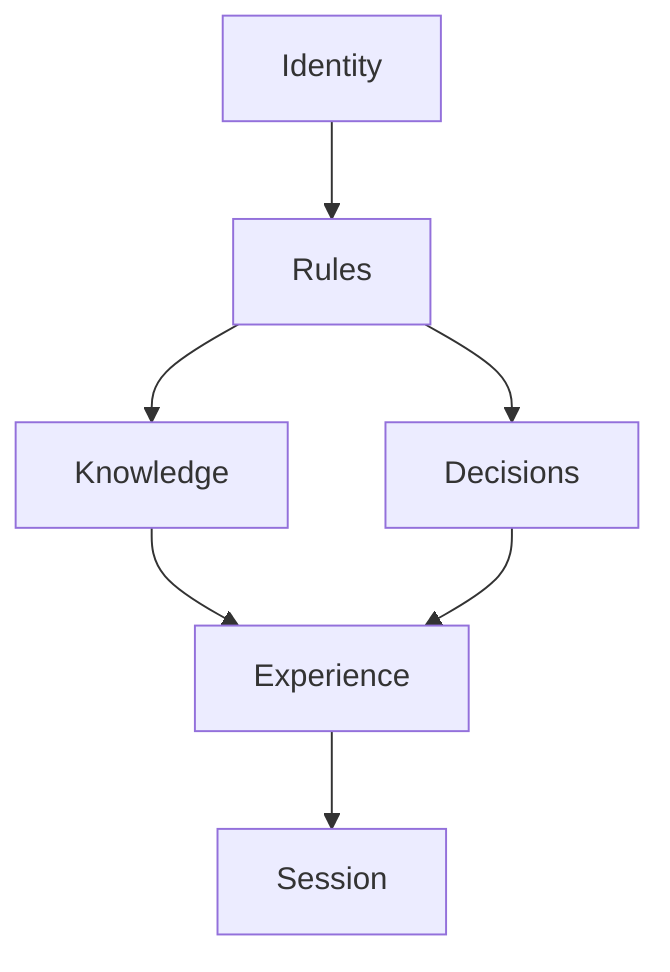
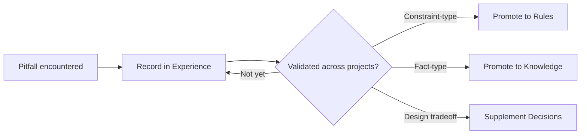

> **Purpose**: A layered framework that gives agent long-term memory a systematic structure — answering "what to remember, what to forget, and when to update."

## 1. The One-Sentence Summary

Agent memory management boils down to three things: **what should be remembered goes into files, what should be forgotten stays in the conversation, and only validated insights get promoted.**

Split memory into six layers — Identity, Rules, Knowledge, Decisions, Experience, Session — each answering different questions with different lifespans, so they deserve different writing styles and maintenance cadences. Layering isn't about labeling things for agents; it's about giving every piece of information a clear home, avoiding "remember everything, remember nothing."

## 2. Why Layering Matters

Bigger context windows aren't always better. Anthropic's [Effective context engineering for AI agents](https://www.anthropic.com/engineering/effective-context-engineering-for-ai-agents) describes a phenomenon called **context rot**: the longer the context, the more scattered the model's attention, and the worse its accuracy at retrieving key information. Stuffing all memory into context is trading attention for capacity — the more you store, the more you lose.

The consequences of not layering, as I've seen in practice, fall into three categories:

1. **Scattered identity** — every session starts from zero, re-aligning "who you are, what style, what boundaries."
2. **Rules diluted by experience** — hard constraints and war stories blur together; the word "must" gradually loses its force.
3. **Temporary crowds out long-term** —琐碎 details from the current task linger in long-term memory, while genuinely useful information gets pushed out.

I initially thought layering was over-engineering — isn't an agent just "a context window plus a file system"? It wasn't until these three problems kept surfacing in real projects that I realized the issue isn't capacity, it's **information without a home**.

## 3. The Six-Layer Model

| Layer | Question it answers | Lifetime | Change frequency |
| --- | --- | --- | --- |
| **Identity** | Who are you? Role, style, boundaries | Very long | Rarely — only when role changes |
| **Rules** | What must you obey? Non-negotiable constraints | Very long | Frequently, requires human confirmation |
| **Knowledge** | What is this project? Architecture, APIs, terminology | Medium-long | Evolves with code |
| **Decisions** | Why was it designed this way? What tradeoffs were made? | Very long | Rarely — append-only, never rewrite |
| **Experience** | What pitfalls have been encountered? What lessons learned? | Medium | Frequently supplemented, corrections allowed |
| **Session** | What is this task about? | Very short | Discarded when task ends |

### Identity Layer

**Core question**: Who are you?

Defines the agent's role (coding assistant, architecture advisor, DevOps), default style (concise, rigorous, encouraging), and behavioral boundaries (what it can do, what it can't, when it should push back).

- Write once, almost never change. Only update when the role itself changes, not for project-specific quirks.
- Lives in the System Prompt or at the top of a **personal** `AGENTS.md`.
- Identity travels with the person, not the project — that's the key distinction from project knowledge.

### Rules Layer

**Core question**: What must you do?

The project's hard constraints: tech stack choices, coding standards, security boundaries, process gates (e.g., "must dry-run before any write operation").

The litmus test is simple: **Is there a cost for violating it? If not, it's not a Rule.** Changes require human confirmation — the agent can propose, but cannot override constraints on its own; only experience validated across projects earns promotion to Rules.

Implementation varies by tool: Claude Code reads `CLAUDE.md`, Cursor reads `.cursor/rules/`, Copilot reads `.github/copilot-instructions.md`, [Pi](https://mariozechner.at/posts/2025-11-30-pi-coding-agent/) has its own skills mechanism. File formats differ, but the function is the same: **hard constraints the agent must not violate**.

### Knowledge Layer

**Core question**: What is this project?

The project's living documentation: architecture and module responsibilities, API contracts, data models, glossaries, environment and deployment.

- Evolves with code — refactoring, removing modules, deprecating APIs all require updates.
- Don't duplicate what the code already expresses clearly.
- Organize with links and directories; don't let a single page grow unbounded.

### Decisions Layer

**Core question**: Why was it designed this way?

Records key architectural choices and tradeoffs: why A over B, accepted technical debt, reasons for deprecating approaches. The standard format is ADR (Architecture Decision Record): **Context → Decision → Consequences**.

The most counterintuitive maintenance principle: **recorded decisions almost never change**. New decisions are appended, never rewritten; when a decision is overturned, add a new entry and mark the old one as deprecated rather than overwriting history. The Decisions layer is the primary reference for onboarding and troubleshooting — it records "why," not "what."

### Experience Layer

**Core question**: What pitfalls have been encountered?

Where the agent's knowledge compounds: pitfall records, workarounds, known limitations, debugging procedures, common mistakes. Format is free, but titles must be searchable (e.g., `2026-08-08-API-timeout-handling.md`).

- **Capture frequently**: every pitfall is worth recording, even if not fully understood — land it first, validate later.
- **Corrections are allowed**: when understanding changes, update and mark the old understanding as outdated; don't perpetuate errors.
- Validated experience is the raw material for promotion to Rules / Knowledge; it also allows demotion.

### Session Layer

**Core question**: What is this task about?

One-time working memory: current goal, progress, unverified leads. Discarded when the task ends, not persisted (unless the user explicitly requests archival). Multi-step tasks can temporarily store `TODO.md` / `SPEC.md`, clean up on completion, or extract valuable parts into Experience / Decisions.

Session is also the "entry point" for other layers — for example, when you hit a pitfall, you naturally Capture it into Experience.

> [Anthropic's official guidance](https://www.anthropic.com/engineering/building-effective-agents) aligns naturally with our implementation: agents should periodically write goals, progress, key decisions, and unresolved issues to notes outside the context, then read them back after the context is cleared. **Memory is "carefully curated working state," not a transcript of the conversation.**

## 4. Layer Relationships and Conflicts

The six layers form a dependency chain:



1. **Identity and Rules** have the longest lifespans, constraining the boundaries of all lower layers.
2. **Knowledge and Decisions** form a relatively stable project portrait — rarely changed, but must stay accurate.
3. **Experience** is the dynamic growth layer — the first landing zone for all "record it first" information, later judged for promotion.
4. **Session** is the execution layer, operating under the constraints and support of the other layers.

When layers conflict, resolve by this priority:

```text
Rules > Identity > Knowledge > Decisions > Experience
```

- **Rules always win** — project hard constraints cannot be bypassed by experience or knowledge.
- **Identity overrides Knowledge** — when the role says "answer concisely" but project docs are verbose, follow the role.
- **Experience cannot override Rules** — even with a workaround, "do not use X" means do not use X; the workaround must either be promoted or abandoned, not quietly used.
- **Decisions can be challenged by new Experience** — when experience repeatedly proves a decision wrong, the correct approach is to create a new ADR to overturn the old one, not silently edit the old record.

## 5. Information Flow Between Layers: Promotion and Demotion

Memory is alive; information moves between layers.

**Promotion path** — from "captured experience" to "hardened knowledge":



**Demotion path** — equally important, often overlooked:

| Scenario | Handling |
| --- | --- |
| Rule no longer applies | Mark `status: deprecated`, preserve history |
| Knowledge entry outdated | Update content, or mark `superseded` with reference to new version |
| Experience proven wrong | Add correction note, mark old record `status: invalid` |
| Decision overturned | Create new ADR, mark old ADR `status: deprecated` |

**Core principle: never delete, only mark.** History is the basis for auditing and understanding evolution — amnesia is not governance, it's an accident.

## 6. Implementation: A Trimable Structure

```text
Project
├── AGENTS.md                 ← Identity: role declaration, style, boundaries
├── CLAUDE.md                 ← Rules: tech stack, coding standards, security gates, process
├── README.md                 ← Knowledge: entry point (points the way, isn't the knowledge itself)
├── CONTEXT.md                ← Knowledge: agent quick-start summary (under 200 lines)
├── docs/
│   └── decisions/            ← Decisions: ADR-001-xxx.md + index README
└── .agent/
    └── experience/           ← Experience: one file per pitfall, searchable titles
```

**10-minute quick start**:

```bash
mkdir -p .agent/experience docs/decisions
touch AGENTS.md CLAUDE.md CONTEXT.md
```

Content doesn't need to be complete on day one:

- `AGENTS.md`: 3 lines. Role in one sentence, style in two words, three boundaries.
- `CLAUDE.md`: only write constraints that truly have a cost for violation — tech stack, forbidden things, mandatory processes.
- `CONTEXT.md`: architecture in one paragraph + key module list + common commands.
- The Experience layer isn't "built" — it accumulates naturally through daily work.

**Already using a single-file `CLAUDE.md`?** First annotate each section with its layer (identity / rules / facts / pitfalls / decisions), then split files according to the structure above. Don't forget to update the agent's read order afterward:

**Read order** (agent's pickup priority when starting work): Session (current context) → Identity → Rules → Knowledge → Experience → Decisions. Decisions comes last because most tasks don't need to revisit design history — only consulted when debugging or making major changes.

## 7. Decision Tree: Where Does This Information Belong?

```
Is it about "who I am"? (role, style, boundaries)          → Identity
Is it a "must obey, cost for violation" hard constraint?   → Rules
Is it a project fact? (architecture, APIs, terminology)    → Knowledge
Is it "why designed this way"? (tradeoffs, choices)        → Decisions
Is it a pitfall, workaround, or debugging experience?      → Experience
Is it temporary context for the current task?              → Session
```

Some examples:

| Information | Where | Why |
| --- | --- | --- |
| "Use camelCase for variables" | Rules | Hard constraint with consequences |
| "`users` endpoint returns 404 for inactive users" | Experience | Pitfall not in documentation |
| "Chose PostgreSQL over MongoDB because..." | Decisions | Design tradeoff |
| "`users` table has a `status` field" | Knowledge | Project fact |
| "I am a senior frontend development assistant" | Identity | Agent identity |
| "Current task: fix login bug" | Session | Temporary, task-related |

## 8. Common Mistakes

- **Writing experience as rules**: "Don't use Y in X" — if it's a known pitfall but not mandatory, put it in Experience; to promote to Rule, get human confirmation first.
- **Writing Identity as Knowledge**: identity declarations like "I am a frontend assistant" travel with the person, not into project knowledge.
- **Delayed Session capture**: spend 30 seconds at task end deciding whether to Capture; otherwise the same problem will be rediscovered next time.
- **Decisions recording only outcomes, not process**: ADR value is in Context and tradeoffs, not the conclusion itself.
- **Mixing Knowledge and Experience**: keep project facts and pitfall experiences separate, so retrieval can distinguish "official definition" from "folk remedy."
- **Assuming all agents have the same rule mechanism**: CLAUDE.md / .cursor/rules / .github/copilot-instructions each have their own reading patterns — the framework is tool-agnostic, but implementation must adapt.

## 9. When Not to Use This Framework

So far it's been about "how to do it," but let's talk about "when not to do it" — I think this part is as important as the main content:

1. **Small projects / personal projects**: a single `CLAUDE.md` might be all you need. Setting up six directories that stay empty isn't memory management, it's ritual.
2. **Short tasks that fit in context**: if one session can handle it, Session is all the memory you need — no layering required.
3. **The agent can't do the work anyway**: layering only solves "the order of memory," not "can it do the work." When underlying capability is lacking, layering is just putting a nice label on low-quality output.
4. **The team has no "writing" habit**: this framework depends on people continuously contributing (especially Rules and Decisions); if people don't invest, the framework spins empty.

One sentence summary: **This framework is a governance upgrade for "agents that already work," not a patch for "agents that don't."**

## References

- [Anthropic — Effective context engineering for AI agents](https://www.anthropic.com/engineering/effective-context-engineering-for-ai-agents) — memory as structured notes, context rot
- [Anthropic — Building effective agents](https://www.anthropic.com/engineering/building-effective-agents) — start with one agent, add complexity incrementally
- [Pi author Mario Zechner's blog](https://mariozechner.at/posts/2025-11-30-pi-coding-agent/) — light harness "state externalization" philosophy, complementary to this framework's Session / Experience implementation


