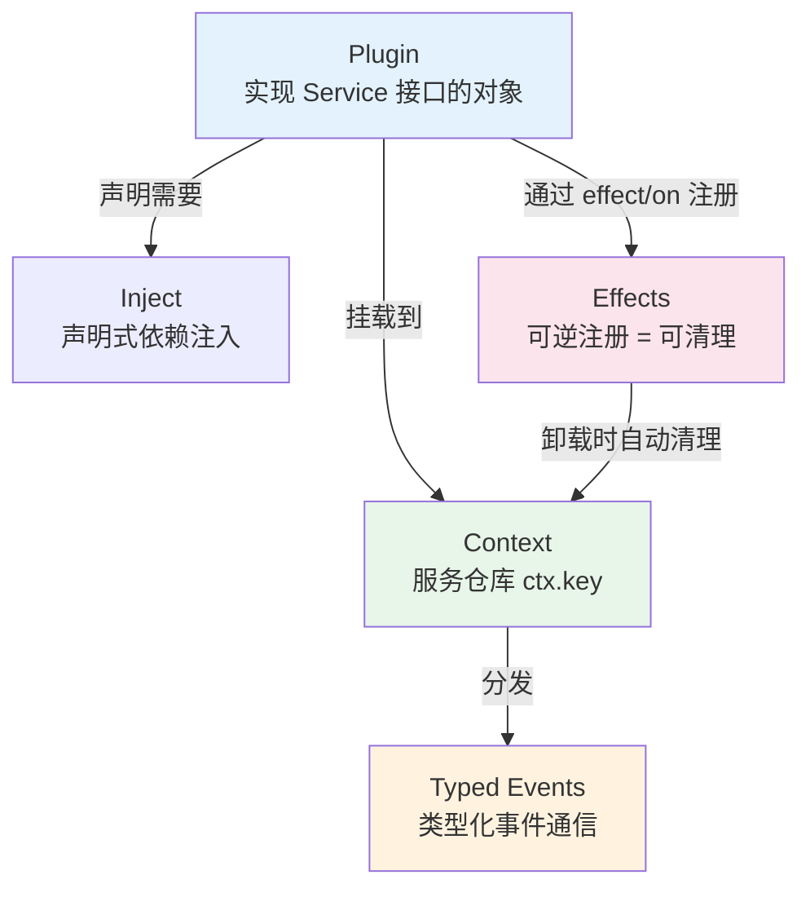
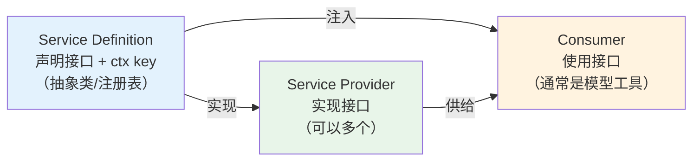
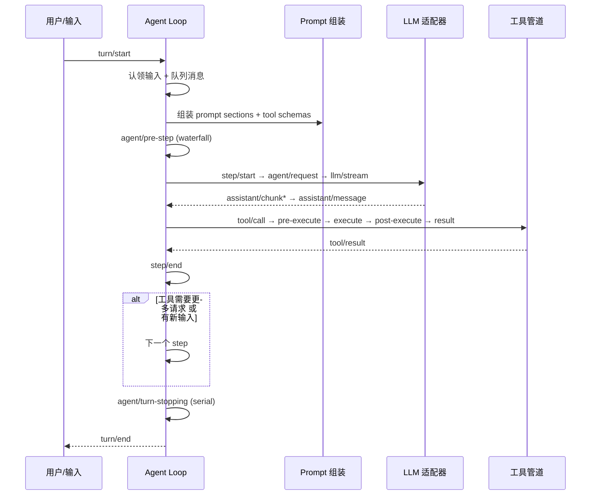
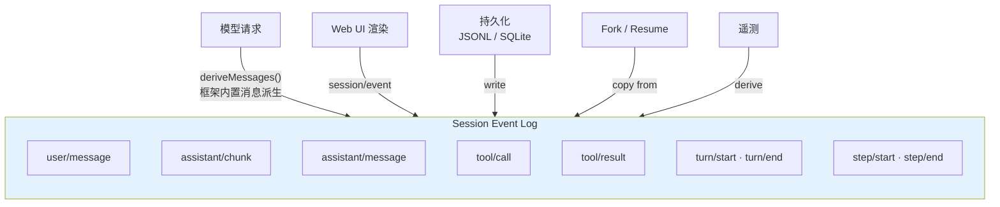
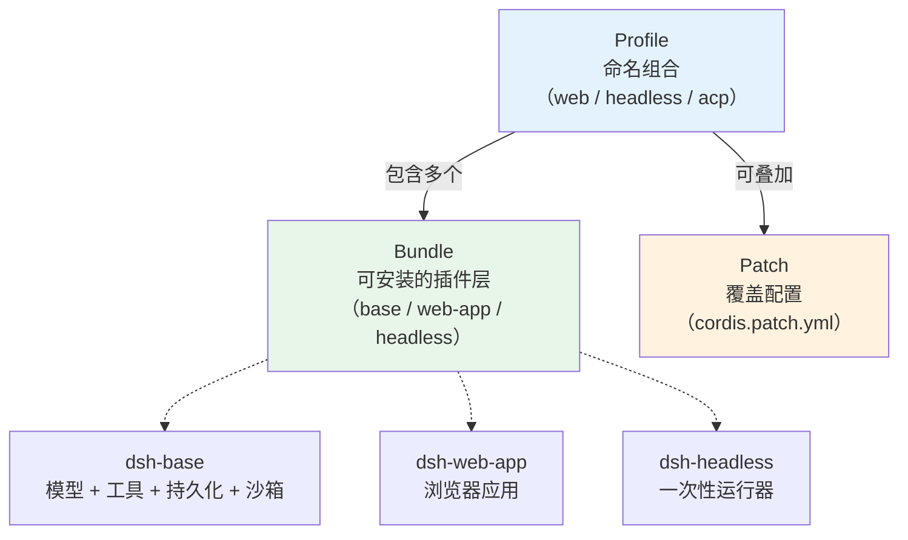

> DeepSeek 开源了一个 Agent Harness。40+ 包、20+ 个能力接缝，最值得注意的是——**Agent Loop 本身是个插件，可以从 YAML 配置里换掉。**
>
> 这篇文章从底层到上层，拆解"一切皆插件"是怎么做到的。


## 一句话定位

DeepSeek Harness 是一个**基于插件架构的 Agent 运行时**。整个产品——包括最核心的 Agent Loop——都是插件拼出来的，没有一个"特权核心"是必须接受其实现的。

想换 LLM 适配器？写一个插件。想换文件系统后端？写一个插件。想换 Agent Loop 本身？写一个插件。

```sh
# 想试一把的话，一行启动 Web UI，默认 http://127.0.0.1:3080
npx @deepseek-ai/dsh web
```

但"插件化"不是喊一句口号就能实现的。它需要从底层机制到上层应用的一整套设计。下面从最底层开始，一层层往上讲。

## 1. 地基：Cordis 插件框架

一切皆插件的根基，是一个叫 Cordis 的插件框架。DeepSeek Harness 把 Cordis 整个 vendored 进来，所有插件能力都建立在它的机制之上。

Cordis 的核心概念不多，四个：



最值得说的是 **Effects 的可逆性**。插件注册的东西（工具、prompt 片段、事件监听器）都走 `ctx.effect()` 或 `ctx.on()`，卸载时自动清理。听起来简单，但翻过不少 Agent 框架的插件系统就知道，真正做到的几乎没有——要么注册了就一直在，要么卸载了但状态没清干净。

Cordis 在底层提供了 effect 机制，DeepSeek Harness 是第一个在 Agent 框架层面把它用到位的：**注册即副作用，卸载即清理**，做成框架级保证。这一条是整个"可替换"能力的前提——如果插件卸载不干净，谁敢换组件？


## 2. 模式：Capability Seam 三层接缝

有了插件框架，下一个问题是：**怎么用插件框架来组织"能力"？**

大部分框架的"加一个能力"就是写个函数注册到工具表。出了问题翻源码找接口，想换后端得改 Consumer。

DeepSeek Harness 把"能力"规范化为三层角色，称为 Seam（接缝）：



拿 Shell 能力举例：

| 角色 | 包 | 职责 |
| --- | --- | --- |
| Service Definition | `dsh-shell` | 声明 `ctx.shell` 接口和类型 |
| Service Provider | `dsh-bash-local` | 本地 bash 执行 |
| Service Provider | `dsh-bash-sandbox` | 沙箱内 bash 执行 |
| Consumer | `dsh-tool-bash` | 模型面对的 bash 工具 |

**换 Provider 不用动 Consumer。** 想从本地执行切到 E2B 远程沙箱，换一个 provider 包就行，工具定义完全不需要改动。这是"可替换"在代码层面的落点。

仓库里有 20+ 个这样的接缝：

| 领域 | 接缝 | Provider 数 |
| --- | --- | --- |
| 模型 | `ctx.llm` | 3（DeepSeek / pi-agents / replay） |
| 文件系统 | `ctx.fs` | 3（local / e2b / sandbox） |
| 子进程 | `ctx.subprocess` | 2（local / e2b） |
| Shell | `ctx.shell` | 2（bash-local / bash-sandbox）+ pwsh |
| 终端 | `ctx.terminals` | 1（terminal-bash） |
| 子代理 | `ctx.subagents` | 6（spawn/fork/sdk/ACP/Codex/Claude Code） |
| 沙箱 | `ctx.sandbox` | 3 后端（bwrap / Landlock / Seatbelt） |
| Web | `ctx.web` | 4（Exa / Perplexity / DeepSeek 搜索 / HTTP fetch） |
| LSP | `ctx.lsp` | 1（stdio） |
| 持久化 | `ctx.sessionPersistence` | 2（JSONL / SQLite） |

子代理有 6 种后端，包括直接对接 Codex 和 Claude Code 的 provider。沙箱也做了三种，分别对应 Linux / macOS 新版 / macOS 传统。

## 3. 应用：Agent Loop 是插件

有了 Cordis 的插件机制和 Seam 的三层模式，"Agent Loop 是插件"就不意外了——它是这套体系最自然的产物。

大多数 Agent 框架的 Loop 是写死的——你想改执行策略就得改核心代码。DeepSeek Harness 把 Loop 做成了一个 `ctx.agentLoop` 服务，跟其他服务平级。你可以在 `cordis.yml` 里指定用哪个实现。

实际扩展的时候不用改源码，不用写 monkey patch：

- 替换 LLM 适配器 → 注册新的 `ctx.llm` provider
- 替换文件系统后端 → 换 `ctx.fs` provider（本地 → E2B 沙箱）
- 替换 Agent Loop → 换 `ctx.agentLoop`
- 添加审批策略 → 监听 `agent/*` 事件

### Agent 事件流

一次 Agent 交互拆成 Turn 和 Step 两层：

- **Turn** — 一次完整的输入消耗，模型 + 工具执行到结束
- **Step** — 一次模型请求 + 触发的工具调用



事件分三种域：

| 事件域 | 持久化？ | 用途 |
| --- | --- | --- |
| `session/*` | ✅ 写入日志 | 跨重启存活的事实 |
| `agent/*` | ❌ 实时 | 观察/拦截工作中的 Agent |
| 能力域事件 | ❌ 实时 | 给接缝附加策略和适配器 |

Waterfall 事件（`agent/pre-step`、`agent/request`、`llm/stream`、`tools/*`）是 around-middleware，监听者必须调 `next()` 委托，不调就短路。与 Express/Koa 中间件模式相同，但增加了类型安全。

## 4. 运营：Session Log 唯一事实源

组件可替换了，运行也跑起来了，但出问题怎么追溯？

Agent 运行过程中模型看到了什么？大部分框架只有 prompt 日志，Session 历史、工具调用、上下文注入散落各处。

DeepSeek Harness 做了一条 append-only 的事件流，叫 Session Log，所有事实从这条流里派生：



有一条规则写得特别硬：**模型可见的（model-visible），必须来自日志**。

这不是"建议"——代码里有运行时不变量断言。如果有东西到达了模型请求但不能从 session log 重建，直接报错。

实际用途：你改了一个上下文注入逻辑，怎么确认模型真的看到了？看日志。日志里没有对应事件，模型就一定没看到。Fork、Resume、遥测——全部从这条流里派生，不用维护第二套状态。

**"model-visible ⟺ logged"这条断言，是我见过最有传播价值的一个 Agent 设计原则。** 它把"模型看到的东西必须可追溯"从一条最佳实践变成了一个运行时检查。

## 5. 配置：Profile + Bundle + Patch

组件可替换了，日志可追溯了，但这么多组件怎么组合成一个可运行的 Agent？

Agent 的运行模式差异很大：Web UI 要服务器 + 前端，Headless 只要一次性执行，ACP 要 JSON-RPC。大部分框架要么写死几种模式，要么靠环境变量拼。

DeepSeek Harness 用了三层：



- **Profile** — 命名组合方案，`web` 和 `headless` 出厂自带
- **Bundle** — 可分发的插件层，一个 profile 堆叠多个 bundle
- **Patch** — YAML 覆盖，替换任意配置行或插入新行

启动顺序：Bundle → profile 级 patch → home 级 patch → `--patch` 命令行覆盖。

```sh
# 看实际启动的配置树
dsh --profile web --dump-config
```

输出的任何一行都可以被 patch 替换。改 YAML 比改代码门槛低，运营也能调 Agent 行为。

## 6. 质量：文档即代码

架构、运营、配置都到位了，但开源项目最怕什么？**文档和代码分家。** 时间一长，文档说的跟代码做的不一样，新贡献者进来一脸懵。

DeepSeek Harness 的解法不是靠人自觉，是把文档一致性做成了 CI 门禁：

文档里粘贴的类型定义跟源码不一致？CI 挂。链接断了？CI 挂。导出的函数没写 JSDoc？CI 挂。文档超字数预算？CI 挂。

非平凡的代码变更必须在同一 PR 附带 Agent Note（设计决策文档）。不是建议，是门禁——没有就合不了。

这种程度的质量控制在开源项目里不常见。但要注意：它是有前提的——前面几层架构设计已经稳定了，才有余力做这种工程基建。**别把"文档即代码"当成第一步，它是最后一步。**

## 7. 对比与取舍

如果用一个坐标系定位 DeepSeek Harness，另一端是 [Pi Agent](/posts/pi-agent-design-philosophy)——一个极简主义的 coding agent。

| 维度 | Pi | DeepSeek Harness |
|------|-----|-----------------|
| 设计哲学 | 能砍就砍 | 能拆就拆 |
| Agent Loop | 写死 | 可替换，可从 YAML 配 |
| 插件化程度 | 轻扩展 | 一切皆服务，40+ 包 |
| 自修改能力 | 人去配置 | Agent 可自挂载/卸载插件 |
| 学习曲线 | 低 | 高（40+ 包） |

两个方向没有对错，看场景。

### 适合参考的场景

1. **自研 Agent 平台需要高度可定制** — 能力接缝的三层角色分离可以直接搬
2. **需要多后端切换**（本地/沙箱/远程）— Provider 模式是标准答案
3. **Session 可靠性要求高** — "model-visible ⟺ logged"断言
4. **团队级 Agent 需要权限控制** — 审批 + 沙箱后端组合

### 不适合的场景

1. **轻量级个人工具** — Pi 的"轻 Harness"更合适，40+ 包的复杂度对个人工具是过度工程
2. **快速原型** — 声明式配置 + 三层组合的学习曲线不适合快速试错
3. **非 TypeScript 技术栈** — 深度绑定 TypeScript 类型系统，移植成本高

### 可直接复用的设计原则

1. **能力做三层接缝**，Service Definition / Provider / Consumer 拆开，换 Provider 不影响 Consumer
2. **Session 日志是唯一事实源**，模型看到的东西必须能从一条日志流重建
3. **注册即副作用，卸载即清理**，别手动管生命周期
4. **配置声明式**，YAML 组合 > 代码 if-else
5. **"model-visible ⟺ logged"做成运行时断言**，不当建议当门禁

## 收尾

Pi 是"能砍就砍"，DeepSeek Harness 是"能拆就拆"。共同点是都想清楚了"什么该在框架里，什么不该在"——Pi 的答案是"尽量少"，DeepSeek 的答案是"全部可插拔"。

如果你在做 Agent 平台，值得带走的三个设计思路：

1. **Capability Seam 三层分离** — Provider 可替换，Consumer 不用改
2. **Session Log 事实源** — 模型看到的东西必须可追溯，且做成运行时断言
3. **Agent Loop 可替换** — 最"核心"的组件也可以不是特权核心

## 附录：基本面

| 项 | 值 |
| --- | --- |
| 仓库 | [deepseek-ai/deepseek-harness](https://github.com/deepseek-ai/deepseek-harness) |
| 版本 | `0.1.0-rc.5`（开发者预览） |
| 许可 | MIT |
| 运行时 | Node.js 22.19+ / 24+ |
| 包管理 | pnpm 11.7 workspaces |
| 底层框架 | Cordis（vendored，有论文） |
| 包数量 | 40+ npm 包（`@deepseek-ai/dsh-*`） |
| 构建工具 | tsc + tsdown |
| 测试策略 | 5 层，含 100% 行覆盖门禁 |


## 参考

- DeepSeek Harness 仓库：[github.com/deepseek-ai/deepseek-harness](https://github.com/deepseek-ai/deepseek-harness)（已核对：README、AGENTS.md、architecture.md、development.md、cordis-primer.md、packages/README.md）
- Cordis 框架：[github.com/cordiverse/cordis](https://github.com/cordiverse/cordis)
- Cordis 论文：[_A Programming Paradigm for Spatiotemporal Composability_](https://github.com/cordiverse/paper)（未逐字核对）
- Pi Agent 设计哲学剖析（对照参考）：[Pi Agent](/posts/pi-agent-design-philosophy)