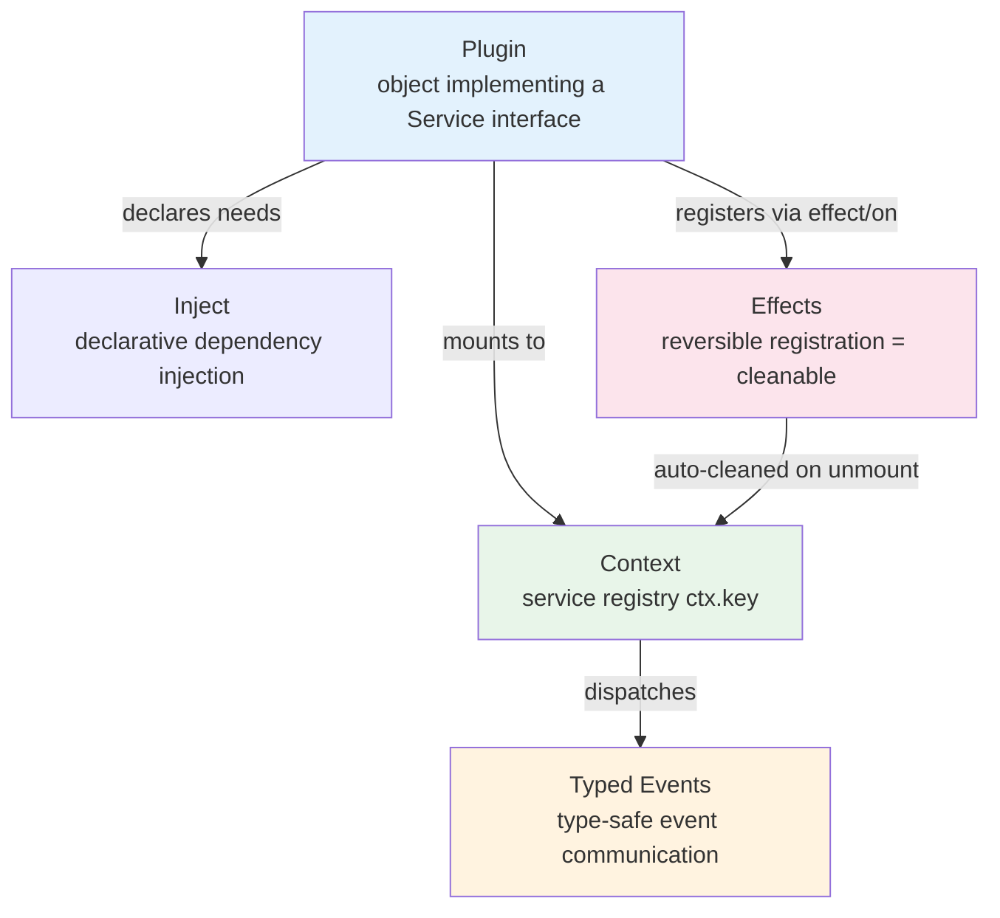
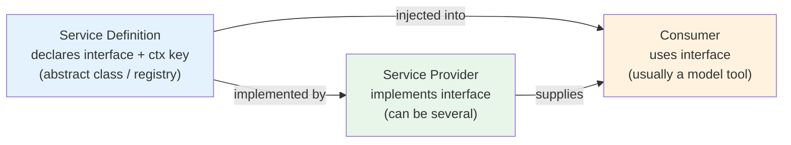
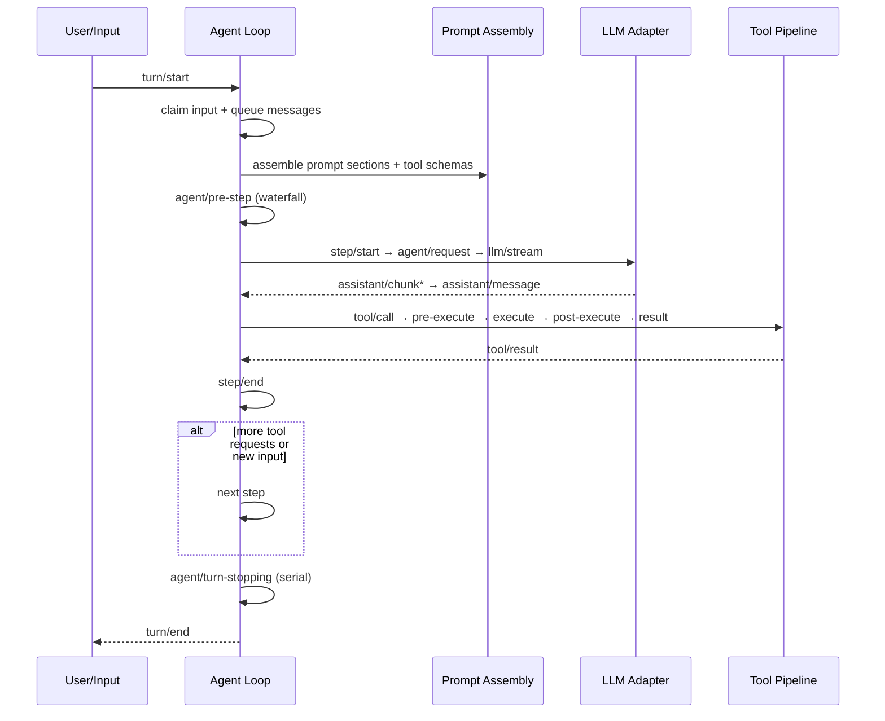
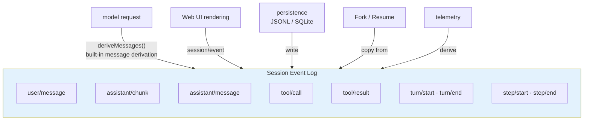
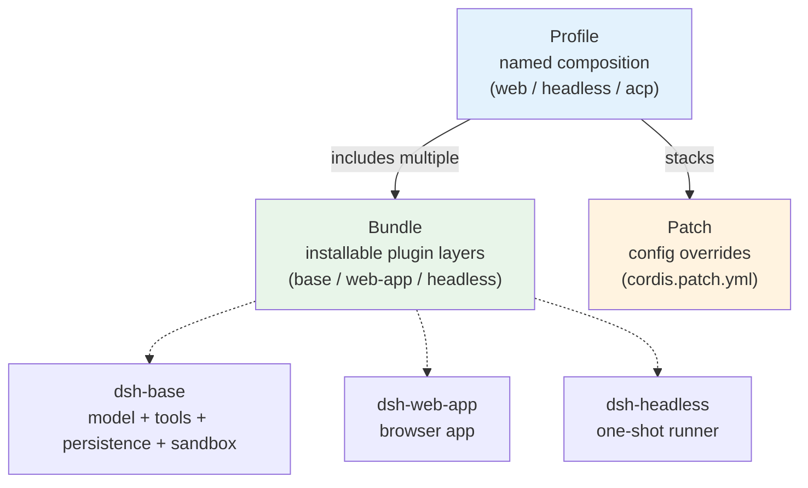

> DeepSeek open-sourced an Agent Harness. 40+ packages, 20+ capability seams — the most notable thing: **the Agent Loop itself is a plugin, swappable from a YAML config.**
>
> This article breaks down how "everything is a plugin" works, from the bottom up.


## The one-liner

DeepSeek Harness is a **plugin-architecture-based Agent runtime**. The entire product — including the core Agent Loop — is assembled from plugins. There is no privileged core whose implementation you're stuck with.

Want a different LLM adapter? Write a plugin. A different filesystem backend? Write a plugin. A different Agent Loop? Write a plugin.

```sh
# One line to start the Web UI, default http://127.0.0.1:3080
npx @deepseek-ai/dsh web
```

But "plugin-ization" isn't something you achieve by shouting a slogan. It requires a complete design from the lowest-level mechanism to the highest-level application. Let's work our way up, layer by layer.

## 1. The foundation: Cordis plugin framework

The foundation of "everything is a plugin" is a framework called Cordis. DeepSeek Harness vendors Cordis in its entirety — all plugin capabilities are built on top of its mechanisms.

Cordis has a small set of core concepts:



The most interesting bit is **the reversibility of Effects**. Everything a plugin registers — tools, prompt snippets, event listeners — goes through `ctx.effect()` or `ctx.on()`, and gets cleaned up automatically on unmount. That sounds simple, but read through enough Agent framework plugin systems and you'll find almost none of them actually do it — either the registration lives forever, or unmounting leaves state behind.

Cordis provides the effect mechanism at the base layer; DeepSeek Harness is the first framework I've seen apply it at the Agent-framework level: **registration is a side effect, unmount is cleanup**, guaranteed at the framework level. This is the prerequisite for the entire "replaceability" story — if plugins can't clean up after themselves, who would risk swapping components?


## 2. The pattern: Capability Seam (three-role separation)

With a plugin framework in place, the next question is: **how do you organize "capabilities" using the plugin framework?**

"Adding a capability" in most frameworks means writing a function and registering it in a tool table. When something breaks you dig through source to find the interface, and switching backends means touching the Consumer.

DeepSeek Harness formalizes "capability" into three roles, called a Seam:



Taking the Shell capability as an example:

| Role | Package | Responsibility |
| --- | --- | --- |
| Service Definition | `dsh-shell` | Declares the `ctx.shell` interface and types |
| Service Provider | `dsh-bash-local` | Local bash execution |
| Service Provider | `dsh-bash-sandbox` | Sandboxed bash execution |
| Consumer | `dsh-tool-bash` | The bash tool the model sees |

**Swapping a Provider doesn't touch the Consumer.** To go from local execution to an E2B remote sandbox, swap one provider package — the tool definition stays exactly as it is. This is where "replaceability" lands in the code.

The repo has 20+ such seams:

| Domain | Seam | Provider count |
| --- | --- | --- |
| Model | `ctx.llm` | 3 (DeepSeek / pi-agents / replay) |
| Filesystem | `ctx.fs` | 3 (local / e2b / sandbox) |
| Subprocess | `ctx.subprocess` | 2 (local / e2b) |
| Shell | `ctx.shell` | 2 (bash-local / bash-sandbox) + pwsh |
| Terminal | `ctx.terminals` | 1 (terminal-bash) |
| Subagents | `ctx.subagents` | 6 (spawn/fork/sdk/ACP/Codex/Claude Code) |
| Sandbox | `ctx.sandbox` | 3 backends (bwrap / Landlock / Seatbelt) |
| Web | `ctx.web` | 4 (Exa / Perplexity / DeepSeek search / HTTP fetch) |
| LSP | `ctx.lsp` | 1 (stdio) |
| Persistence | `ctx.sessionPersistence` | 2 (JSONL / SQLite) |

The 6 subagent backends include providers that talk directly to Codex and Claude Code. The sandbox also comes in three flavors (bwrap / Landlock / Seatbelt), covering Linux, macOS's newer security module, and the classic macOS sandbox.

## 3. The application: Agent Loop is a plugin

With Cordis's plugin mechanism and the Seam three-role pattern, "Agent Loop is a plugin" is no surprise — it's the most natural outcome of the system.

In most Agent frameworks the loop is hard-coded — changing execution strategy means changing core code. DeepSeek Harness makes the Loop a `ctx.agentLoop` service, on equal footing with every other service. You specify which implementation to use in `cordis.yml`.

Extending it doesn't require editing source or writing monkey patches:

- Swap the LLM adapter → register a new `ctx.llm` provider
- Swap the filesystem backend → swap the `ctx.fs` provider (local → E2B sandbox)
- Swap the Agent Loop → swap `ctx.agentLoop`
- Add an approval policy → listen to `agent/*` events

### Agent event flow

A single agent interaction splits into two layers, Turn and Step:

- **Turn** — one complete input consumption, from model through tool execution to the end
- **Step** — one model request plus the tool calls it triggers



Events live in three domains:

| Event domain | Persisted? | Purpose |
| --- | --- | --- |
| `session/*` | ✅ written to log | facts that survive restarts |
| `agent/*` | ❌ real-time | observe/intercept a live Agent |
| Capability-domain events | ❌ real-time | attach policy and adapters to seams |

Waterfall events (`agent/pre-step`, `agent/request`, `llm/stream`, `tools/*`) are around-middleware — listeners must delegate via `next()`, and the chain short-circuits if they don't. Same pattern as Express/Koa middleware, but type-safe.

## 4. Operations: Session Log as the single source of truth

Components are replaceable, the runtime runs — but how do you trace problems when things go wrong?

What does the model actually see during a run? Most frameworks only keep a prompt log; session history, tool calls, and context injection are scattered around.

DeepSeek Harness builds an append-only event stream called the Session Log, and derives every fact from it:



There's one rule that's enforced especially hard: **model-visible must be logged**.

This isn't a "suggestion" — there's a runtime invariant assertion in the code. If something reaches a model request but can't be rebuilt from the session log, it errors out.

Practical payoff: you changed a context-injection rule — how do you confirm the model actually saw it? Check the log. No corresponding event in the log, and the model definitely didn't see it. Fork, Resume, telemetry — all derived from that one stream, no second set of state to maintain.

**The "model-visible ⟺ logged" invariant is the single most portable Agent design principle I've come across.** It turns "what the model sees must be traceable" from a best practice into a runtime check.

## 5. Configuration: Profile + Bundle + Patch

Components are replaceable, the log is traceable — but how do you compose all these pieces into a working Agent?

Agent run modes differ a lot: the Web UI needs a server plus frontend, Headless is a one-shot runner, ACP speaks JSON-RPC. Most frameworks either hard-code a few modes or cobble them together from env vars.

DeepSeek Harness uses three layers:



- **Profile** — a named composition; `web` and `headless` ship out of the box
- **Bundle** — a distributable plugin layer; a profile stacks multiple bundles
- **Patch** — a YAML override; replace any config line or insert new ones

Boot order: Bundle → profile-level patch → home-level patch → `--patch` CLI override.

```sh
# Inspect the actual config tree that boots
dsh --profile web --dump-config
```

Any line of the output can be replaced by a patch. Editing YAML has a lower bar than editing code, so operators can tune Agent behavior without touching source.

## 6. Quality: docs as code

Architecture, operations, and configuration are all in place — but what's the biggest fear for an open-source project? **Docs and code drifting apart.** Over time, the docs say one thing and the code does another. New contributors walk in confused.

DeepSeek Harness's answer isn't "people should be disciplined" — it's **making doc consistency a CI gate**:

A type definition pasted into the docs doesn't match the source? CI fails. A broken link? CI fails. An exported function missing JSDoc? CI fails. Docs over the word budget? CI fails.

Any non-trivial code change must ship with an Agent Note (a design-decision doc) in the same PR. Not a suggestion — a gate. No note, no merge.

This level of quality control is rare in open source. But it has a prerequisite — the architecture layers above must be stable first, so there's bandwidth for this kind of engineering infrastructure. **Don't treat "docs as code" as step one. It's the last step.**

## 7. Comparison and trade-offs

If you were to place DeepSeek Harness on a coordinate system, the opposite end would be [Pi Agent](/posts/pi-agent-design-philosophy) — a minimalist coding agent.

| Dimension | Pi | DeepSeek Harness |
|-----------|-----|-----------------|
| Design philosophy | Cut what you can | Split what you can |
| Agent Loop | Hard-coded | Replaceable, configurable from YAML |
| Plugin-ization | Light extension | Everything-as-a-service, 40+ packages |
| Self-modification | Human configures it | Agent can mount/unmount its own plugins |
| Learning curve | Low | High (40+ packages) |

Neither direction is right or wrong — it depends on the scenario.

### Where this is worth referencing

1. **Building a highly-customizable Agent platform** — the three-role capability seam separation ports directly
2. **Need multi-backend switching** (local / sandbox / remote) — the Provider pattern is the standard answer
3. **Session reliability matters** — the "model-visible ⟺ logged" invariant
4. **Team-grade agents need access control** — approvals + sandbox backends combined

### Where it's not a fit

1. **Lightweight personal tools** — Pi's "light Harness" fits better; 40+ packages is over-engineering for a personal tool
2. **Rapid prototyping** — the declarative config + three-layer composition learning curve doesn't suit fast trial-and-error
3. **Non-TypeScript stacks** — it's deeply tied to the TypeScript type system; porting cost is high

### Directly reusable design principles

1. **Build capabilities as three-role seams** — split Service Definition / Provider / Consumer so swapping a Provider never touches the Consumer
2. **Make the session log the single source of truth** — what the model sees must be reconstructible from one log stream
3. **Registration as side effect, unmount as cleanup** — don't manage lifecycle by hand
4. **Keep config declarative** — YAML composition over code if-else
5. **Turn "model-visible ⟺ logged" into a runtime assertion** — a gate, not a guideline

## Closing

Pi is "cut what you can", DeepSeek Harness is "split what you can". What they share is having thought hard about "what belongs in the framework and what doesn't" — Pi's answer is "as little as possible", DeepSeek's is "everything pluggable".

If you're building an Agent platform, three design ideas are worth taking with you:

1. **Capability Seam three-role separation** — Providers are replaceable, Consumers don't change
2. **Session Log as source of truth** — what the model sees must be traceable, enforced as a runtime invariant
3. **Replaceable Agent Loop** — even the most "core" component doesn't have to be a privileged core

## Appendix: Basics

| Item | Value |
| --- | --- |
| Repo | [deepseek-ai/deepseek-harness](https://github.com/deepseek-ai/deepseek-harness) |
| Version | `0.1.0-rc.5` (developer preview) |
| License | MIT |
| Runtime | Node.js 22.19+ / 24+ |
| Package manager | pnpm 11.7 workspaces |
| Underlying framework | Cordis (vendored, has a paper) |
| Package count | 40+ npm packages (`@deepseek-ai/dsh-*`) |
| Build | tsc + tsdown |
| Testing | 5 layers, including a 100% line-coverage gate |


## References

- [DeepSeek Harness repo](https://github.com/deepseek-ai/deepseek-harness) — verified: README, AGENTS.md, architecture.md, development.md, cordis-primer.md, packages/README.md
- [Cordis framework](https://github.com/cordiverse/cordis)
- [Cordis paper: A Programming Paradigm for Spatiotemporal Composability](https://github.com/cordiverse/paper) (not line-by-line verified)
- Comparison reference: [Pi Agent Design Philosophy](/posts/pi-agent-design-philosophy)