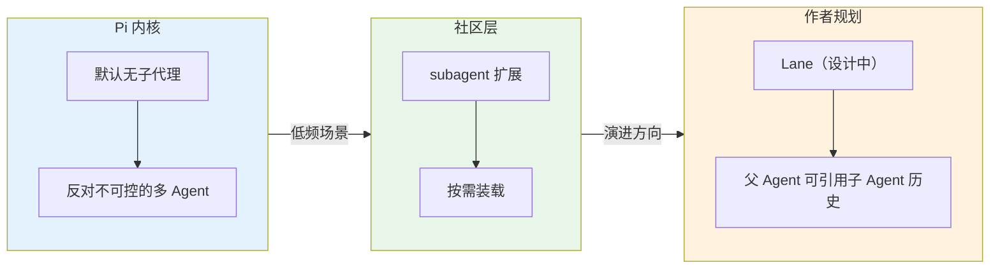
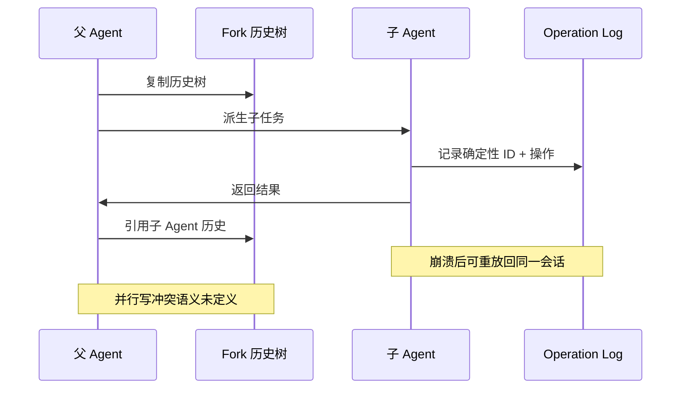

> 从"毛坯房"到"轻 Harness"——Pi Agent 砍掉的东西，比它有的东西更能说明它的设计哲学。本文剖析六个关键决策，给出自研 Harness 的 5 条实操建议。

最近研究 Pi 的设计，整理了一些观点，分享出来。

## 先说结论

一句话讲完：**轻 Harness——把上下文让给模型，把复杂度推向边界**（推到你的 `todo.md`、推到扩展商店、推到你手边多开的那个终端）。

这篇不准备罗列功能，只拆一个东西：Pi 为什么敢把功能砍得这么狠。砍到后来你会发现，**它的"没有"清单比"有"清单更能说明它的设计哲学**。

## 我一开始觉得它是个毛坯

第一次打开 Pi 的默认配置，我的反应就四个字：这也太毛坯了。没有 todo、没有 plan、没有权限控制、没有 MCP，连后台命令都没有——见过做减法的，没见过这么狠的。

作者 Mario Zechner 在[博客](https://mariozechner.at/posts/2025-11-30-pi-coding-agent/)里的理由：**顶尖模型经过大量 RL 训练，精简上下文也能做得很好**。知乎[《pi agent 毛坯房装修踩坑》](https://zhuanlan.zhihu.com/p/2065803117564843711)说得更通俗：harness 的很多功能就是在上下文里雕花，每加一行规则，模型注意力就被分走一份。再加上 [Databricks 的评测](https://www.databricks.com/blog/benchmarking-coding-agents-databricks-multi-million-line-codebase)显示同模型下 Pi 的通过率/花费比领先 Codex 和 Claude Code，理由看着挺全。

——不过先别急着信，这三样数据我都是二手转述，没逐字核对原文，当方向判断看就行。

用了一阵子我才回过味来：Pi 不是"功能少"，是**故意不做**。毛坯房是没来得及装修，Pi 是掂量过之后决定不装。掂量的结果是——**稀缺的不是功能，是上下文；复杂的东西别堆在 prompt 里，推到系统外面去**。这跟"记忆管理框架"里的思路一模一样：让 Agent 记什么、忘什么，本质都是在跟稀缺资源讨价还价。

## 砍得最漂亮的一刀：约束写进了 API

Pi 里没有"不准删除文件"这种规则文本——它的做法更简单：**直接 yolo 全放开，bash 什么命令都能跑**。

但这里有个值得品的设计思路：**把"不准做什么"从规则层沉到能力层**。让一个不存在的工具拦住它，比写十句"禁止删除"都管用。Pi 没走这条路，但它的"轻"哲学给了这个方向启发。我一开始觉得这作者是懒，后来发现是巧。

同一把刀还用在第二处：**低频能力不进上下文**。Pi 的扩展工具（比如 CLI 工具）按需装载，不在默认上下文中注册工具定义——用到的才挂上，不占长期预算，这就是"注意力税"的极致用法。

## 最想反驳的一条：没有子代理

先说清楚三个层次，免得误读：**Pi 内核默认没有子代理；社区有 subagent 扩展；作者说不完全否定**（未来的 Lane 正在认真做）。它反对的从不是多 Agent，而是**不可控的多 Agent**。

正方论证我听过很多了，Pi 作者自己的说法最有意思——"子代理是黑盒中的黑盒"：父 Agent 看不到子 Agent 的思维过程，只能看最终输出，"可控性差，因为不怎么看"，所以要"让 Pi 生成自己，而不是派生分身"。OpenAI 和 Anthropic 的官方指南也站在类似立场：[OpenAI](https://openai.com/business/guides-and-resources/a-practical-guide-to-building-ai-agents/)说"从一个 Agent 开始，只有出现可以直接衡量的失败（选错工具、难归因 bug）才切多 Agent"（未逐字核对原文）；[Anthropic](https://www.anthropic.com/engineering/building-effective-agents)提醒多 Agent 会带来"higher costs, and the potential for compounding errors"（更高成本、错误会复合），以及框架带来的"extra layers of abstraction"。三个各带毛病的子 Agent，最终合成器等于把三份错误叠在一起。

**但我必须给反方留个位置**：有一个场景它是无解的——**单个任务上下文超过单个模型窗口**。跨全库重构、全库审计这种，让"同一个 Pi 继续做"必然上下文超出窗口限制，这时候子代理/并行隔离是唯一解。所以我的结论不是"子代理没用"，而是：**低频 ≠ 不存在，你要为低频备好门路，但别让门路成为默认常驻的机制**。这跟 Pi 自己的做法一致：门路做扩展、做 v2 设计，不默认内置。

## yolo 我认一半，但防错要防对

"默认 yolo 全放行"，作者的原话是这么说的：**"pi runs in full YOLO mode, unrestricted access to your filesystem, no permission prompts"**。他的意思很直白：模型总能想办法绕过权限，别退缩，退缩就别玩。这句话我认可一半——安全性上有两点要说清：

1. **权限系统防的不是"恶意"**，一个会绕过权限的模型，你用 prompt 约束它纯属白搭——这点作者对的；
2. **权限真正防的是"错误"**：模型幻觉删了生产目录，不设权限=破坏半径不可控。所以 yolo 只在"环境可信 + 操作可回滚"（个人机器 + git 兜底）下成立，**团队场景不成立**。

这句是全文我最不同意的：权限问题分两个方向，作者只防了"恶意"，把"犯错的半径"这条线砍了。个人用没事，迁到团队时记得把权限拿回来。

## 那些"没有"的，为什么没问题（快答清单）

| 没有的 | 为什么 | 我的态度 |
| --- | --- | --- |
| todo / plan 模式 | 形成**"人机共读的 md 文件"**，不是框架内部状态机 | 信服 |
| MCP | 工具 schema 全量进 prompt，税太重 | 部分认同 |
| 后台命令 | 不可见即不可控，终端多开互不打扰 | 部分认同 |
| 一切内置机制 | 复杂度是负债，常驻着不可控 | 信服 |

## 最想吐槽的一张"饼"：Lane

**先泼冷水：Harness v2 现在还只是仓库里的一篇设计文档（harness-v2.md），没有交付。**（未核实原文，据社区讨论转述）但设计长这样：

Fork 复制历史树；父 Agent 能引用子 Agent 的历史（补"看不见"）；确定性 ID + operation log 保证崩溃后能重放回同一个子会话。

听起来不错，我想问三个问题：

1. **确定性 ID 只保证"挂回同一个会话"，不保证"重跑结果一致"**：子 Agent 的工具调用都是副作用（跑命令、写文件），转录能重放，副作用不能。设计稿里这段语焉不详。
2. **父又共享、父又写**：并行写同一棵树的冲突语义，现在等于没定义。
3. **"无状态"不见了**：恢复要持久化、要事务性。号称无状态的 Pi，居然自己给自己打这个补丁——**"轻"不是宗教，条件变了它自己会让步**。

## 什么场合别用（也别抄）

- 用的不是顶级模型——"轻"是模型的果，不是因；
- 想开箱即用——它默认连联网都没有；
- 团队场景要合规——yolo + 无状态与权限审计天然冲突。

## 如果要抄作业（自研 Harness）

1. 每个功能进 system prompt 前问一句：**这笔注意力税值不值？**能写进 API 就不写进 prompt；
2. 低频能力默认不装，用到再挂；
3. 状态放 .md，别自己造私有状态机；
4. 多 Agent 先做 trace 和重放，不要先从"并发"开始；
5. **yolo 别抄**，个人机可以，给它兜底 git，团队里把它换成"权限漏斗"。

## 收尾

研究 Pi 最大的收获不是"怎么用"，是它那个"没有清单"提醒我的：**真正的取舍不在于"做了什么"，而在于"忍住不做什么"**。做减法比做加法难，也值钱得多。

## 参考

- Pi 作者 Mario Zechner 博客：[mariozechner.at](https://mariozechner.at/posts/2025-11-30-pi-coding-agent/)（已核对：YOLO 模式、bash 全放开、无子代理、无默认联网）
- Databricks 评测：[databricks.com/blog](https://www.databricks.com/blog/benchmarking-coding-agents-databricks-multi-million-line-codebase)（二手转述，未逐字核对）
- OpenAI《A Practical Guide》：[openai.com](https://openai.com/business/guides-and-resources/a-practical-guide-to-building-ai-agents/)（未核实原文）
- Anthropic《Building Effective Agents》：[anthropic.com](https://www.anthropic.com/engineering/building-effective-agents)（已核对：higher costs, compounding errors, extra layers of abstraction）
- 知乎《pi agent 毛坯房装修踩坑》（黒猫道）：[zhuanlan.zhihu.com](https://zhuanlan.zhihu.com/p/2065803117564843711)（未核实原文）