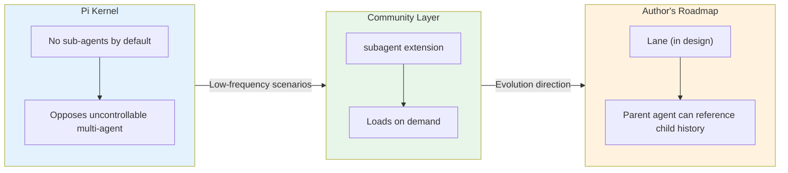
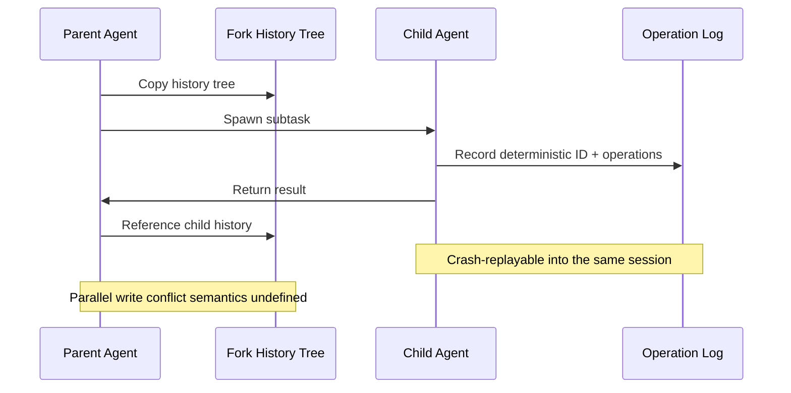

> From "bare-bones apartment" to "lightweight harness" — what Pi Agent cut away says more about its design philosophy than what it kept. This post dissects six key decisions, and ends with 5 practical suggestions for building your own harness.

I recently spent some time studying Pi's design, and organized a few observations worth sharing.

## The Conclusion Up Front

One sentence: **light harness — give the context window back to the model, push complexity to the boundaries** (into your `todo.md`, your extension store, that extra terminal you keep open).

This post won't list features. It dissects one thing: why Pi dares to cut features so aggressively. By the end you'll see that its "absence list" explains its design philosophy better than its "feature list."

## At First I Thought It Was a Bare-Bones Shell

My first reaction to Pi's default config was: this is too bare-bones. No todo, no plan, no permission prompts, no MCP, no background commands — I've seen minimalism, but never this aggressive.

Author Mario Zechner explains in his [blog post](https://mariozechner.at/posts/2025-11-30-pi-coding-agent/): **top models have been trained with heavy RL, so they perform well even with lean context**. A Zhihu [post about "furnishing the Pi bare-bones apartment"](https://zhuanlan.zhihu.com/p/2065803117564843711) puts it more plainly: many harness features are just ornament carved into the context — every added rule drains a slice of the model's attention. Plus [Databricks' benchmark](https://www.databricks.com/blog/benchmarking-coding-agents-databricks-multi-million-line-codebase) shows Pi's pass-rate-per-dollar beating Codex and Claude Code on the same models. The rationale seems solid.

— But before you take my word for it: all three data points are second-hand. I haven't verified them line by line against the originals. Treat them as directional signals.

After using it for a while, it clicked: Pi isn't "short on features," it's **deliberately not building them**. A bare-bones apartment just hasn't been furnished yet; Pi weighed the options and decided not to furnish. The calculus: **what's scarce isn't features, it's context — so don't pile complexity into the prompt, push it outside the system.** This echoes the logic of the memory-management framework: deciding what an agent remembers and forgets is, at bottom, bargaining over a scarce resource.

## The Best Cut: Constraints Written Into the API

There's no "you may not delete files" rule text in Pi — its approach is simpler: **full YOLO, bash runs anything.**

But there's a design idea worth savoring: **sink "what you must not do" from the rules layer down to the capability layer.** A tool that doesn't exist can stop an agent better than ten lines of "forbidden." Pi didn't take that road, but its "light" philosophy points in that direction. I initially thought the author was lazy; turns out he was clever.

The same knife cuts twice: **low-frequency capabilities stay out of context.** Pi's extension tools (e.g., CLI tools) load on demand — tool definitions aren't registered in the default context; only what you use gets attached. Low-frequency features don't burn long-term budget. That's the "attention tax" maximized.

## The Claim I Most Want to Push Back On: No Sub-Agents

First, three levels so we don't misread it: **Pi's kernel has no sub-agents by default; the community has a subagent extension; the author doesn't rule it out entirely** (the future Lane feature takes it seriously). What it opposes isn't multi-agent per se, but **uncontrollable multi-agent**.

I've heard plenty of pro arguments; Pi's author has the most interesting take — "a sub-agent is a black box inside a black box": the parent can't see the sub-agent's reasoning, only its final output, so "controllability suffers because you can't really watch it." Hence "have Pi generate itself, rather than spawning clones." OpenAI and Anthropic's official guides take a similar stance: [OpenAI](https://openai.com/business/guides-and-resources/a-practical-guide-to-building-ai-agents/) says "start with a single agent, only split into multi-agent when directly measurable failures appear (wrong tool choices, hard-to-attribute bugs)" (paraphrased, unverified against the original); [Anthropic](https://www.anthropic.com/engineering/building-effective-agents) warns that multi-agent brings "higher costs, and the potential for compounding errors," plus the "extra layers of abstraction" from frameworks. Three sub-agents each with their own issues — the final composer just stacks three copies of error.

**But I have to leave room for the opposition**: there's one scenario it can't solve — **a single task whose context exceeds a single model window**. Cross-repo refactors, whole-repo audits — letting "the same Pi keep going" necessarily blows past the context limit, and sub-agents/parallel isolation are the only answer. So my conclusion isn't "sub-agents are useless," it's: **low-frequency ≠ nonexistent — keep a door ready for low-frequency needs, but don't make the door a permanently resident mechanism.** That matches Pi's own approach: the door exists as an extension, as a v2 design — not built in by default.

## YOLO I Accept Halfway — But Guard Against the Right Thing

On "YOLO by default," the author's exact words: **"pi runs in full YOLO mode, unrestricted access to your filesystem, no permission prompts."** The point is blunt: models can always find a way around permissions, so don't shrink — if you shrink, you're out of the game. I agree with half of it. Two things need to be said about safety:

1. **A permission system doesn't stop "malice."** If a model will circumvent permissions, constraining it with prompts is pointless — the author is right on this.
2. **Permissions actually guard against "mistakes."** A hallucinating model deletes your production directory; no permissions means an uncontrolled blast radius. So YOLO only holds when "environment is trusted + operations are rollbackable" (personal machine + git as safety net). **It does not hold for team scenarios.**

This is the line I disagree with most in the whole post: the permission problem has two directions; the author only guards against "malice" and cuts the "mistake radius" line. Fine for personal use — just remember to bring permissions back when you move to a team.

## Why the "Absences" Are Fine (Quick-Fire List)

| Absent feature | Why it's fine | My stance |
| --- | --- | --- |
| todo / plan mode | A **"human-machine co-readable md file"**, not a framework-internal state machine | Convinced |
| MCP | Full tool schemas in the prompt — too heavy a tax | Partially agree |
| Background commands | What you can't see you can't control; multiple terminals don't interfere | Partially agree |
| Everything built-in | Complexity is debt; resident complexity is uncontrollable | Convinced |

## The "Pie" I Most Want to Poke: Lane

**Cold water first: Harness v2 is still a design doc in the repo (`harness-v2.md`), not shipped.** (Unverified against the original — per community discussion.) But the design looks like this:

Fork copies the history tree; the parent can reference the child's history (patches "can't see inside"); deterministic IDs + an operation log guarantee crash-replay into the same child session.

Sounds nice. I have three questions:

1. **A deterministic ID only guarantees "re-attaching to the same session," not "re-running produces the same result."** Every tool call a child makes is a side effect (running commands, writing files). Transcripts can be replayed; side effects can't. The design doc is vague here.
2. **The parent both shares and writes.** The conflict semantics of parallel writes to the same tree are currently undefined.
3. **"Stateless" has quietly disappeared.** Recovery requires persistence and transactionality. The supposedly stateless Pi is patching itself — **"light" isn't a religion; when conditions change, it makes a concession.**

## When Not to Use It (or Copy It)

- You're not using a top-tier model — "light" is a consequence of the model, not a cause;
- You want out-of-the-box — it doesn't even ship with internet access by default;
- Your team scenario needs compliance — YOLO + statelessness inherently conflicts with permission auditing.

## If You're Copying the Homework (DIY Harness)

1. Before any feature enters the system prompt, ask: **is this attention tax worth it?** If it can live in the API, keep it out of the prompt;
2. Low-frequency capabilities aren't installed by default — attach on use;
3. State lives in `.md` files — don't build a private state machine;
4. For multi-agent, start with trace and replay, not with "concurrency";
5. **Don't copy YOLO.** Fine on a personal machine with git as a safety net; in a team, replace it with a "permission funnel."

## Closing

The biggest takeaway from studying Pi isn't "how to use it" — it's what the "absence list" reminded me of: **the real tradeoff isn't in what you build, but in what you hold yourself back from building.** Subtraction is harder than addition, and worth more.

## References

- Pi author Mario Zechner's blog: [mariozechner.at](https://mariozechner.at/posts/2025-11-30-pi-coding-agent/) (verified: YOLO mode, full bash access, no sub-agents, no default internet)
- Databricks benchmark: [databricks.com/blog](https://www.databricks.com/blog/benchmarking-coding-agents-databricks-multi-million-line-codebase) (second-hand, not verified line-by-line)
- OpenAI — A Practical Guide: [openai.com](https://openai.com/business/guides-and-resources/a-practical-guide-to-building-ai-agents/) (unverified against the original)
- Anthropic — Building Effective Agents: [anthropic.com](https://www.anthropic.com/engineering/building-effective-agents) (verified: higher costs, compounding errors, extra layers of abstraction)
- Zhihu — "Pi agent 毛坯房装修踩坑": [zhuanlan.zhihu.com](https://zhuanlan.zhihu.com/p/2065803117564843711) (unverified against the original)