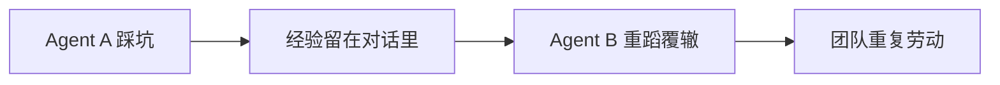
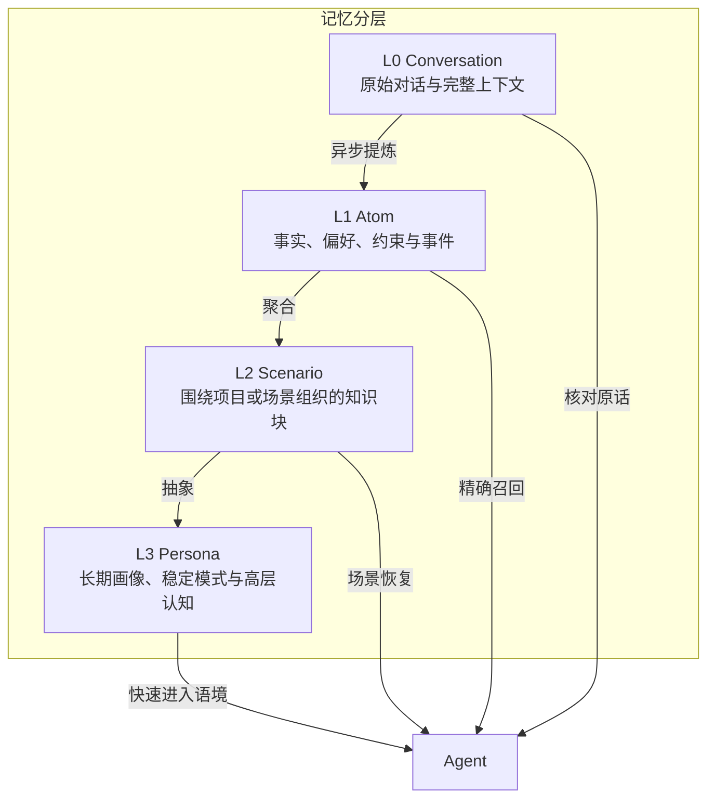
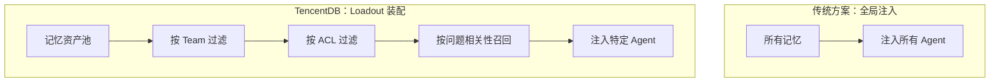
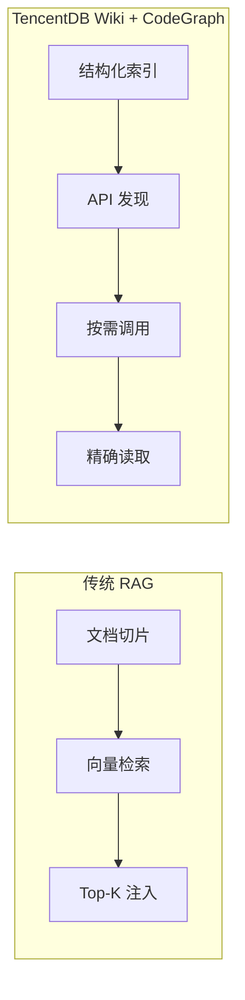
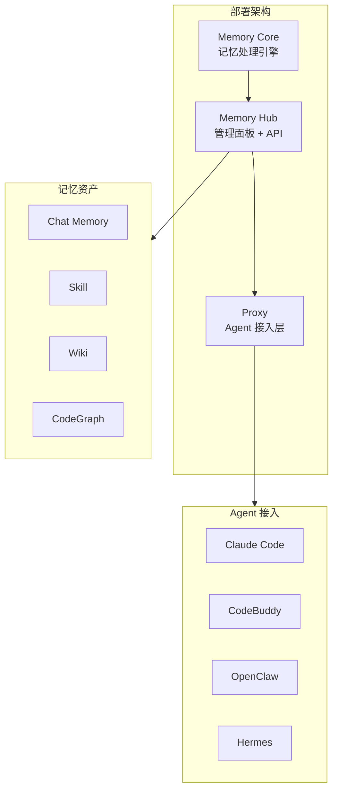
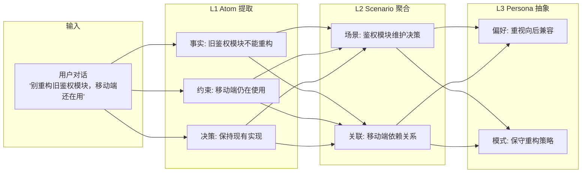
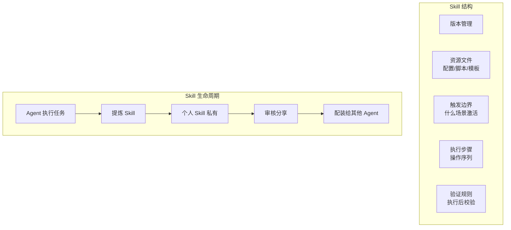
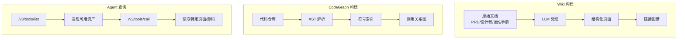

> 项目背景讲过了，不该换个 Session 再讲。文档读过了，不该每个 Agent 从第一页重读。一套做法已经跑通，不该下次再摸索一遍。

这是腾讯开源的 [TencentDB Agent Memory](https://github.com/TencentCloud/TencentDB-Agent-Memory) 项目 README 里的一段话。读完之后，我意识到它戳中了当前 Agent 应用的一个核心痛点：**经验无法沉淀，每次都是从零开始**。

这篇文章剖析 TencentDB Agent Memory 的设计思路，看看它如何解决这个问题。

## 核心问题：Agent 的"健忘症"



大多数 Agent 的工作模式是这样的：你花 20 分钟教它项目背景，它完成了任务，然后对话结束。下次换个 Agent 或换个 Session，一切重来。

TencentDB Agent Memory 的解法很直接：**把经验变成可复用的资产，让下一个 Agent 直接读档开工**。

## 设计哲学：三个核心判断

在深入技术细节之前，先看 TencentDB Agent Memory 背后的三个设计判断。这三个判断决定了整个产品的走向：

### 判断一：记忆不是平铺的，而是分层生长的

大多数 Agent 记忆方案把所有信息平铺存储，查询时一次性召回。TencentDB 的选择是**分层**：



| 层级 | 保存什么 | 主要用途 | 检索策略 |
|------|---------|---------|---------|
| **L0 Conversation** | 原始对话与完整上下文 | 核对原话、时间和来源 | BM25 精确匹配 |
| **L1 Atom** | 事实、偏好、约束与事件 | 精确召回可执行信息 | 向量检索 + RRF |
| **L2 Scenario** | 围绕项目或场景组织的知识块 | 快速恢复一个工作场景 | 语义检索 |
| **L3 Persona** | 长期画像、稳定模式与高层认知 | 让 Agent 进入用户和团队语境 | 直接注入 |

**为什么这样设计？**

上下文窗口是稀缺资源。如果每次都注入 L0 全量对话，token 消耗会爆炸。但如果只注入 L3 高度抽象的画像，又会丢失具体细节。分层让系统可以根据当前需求**按需召回**：平时用 L2/L3 快速进入语境，需要具体事实时通过 BM25 + 向量检索 + RRF 融合回到 L1/L0。

这是一个**精度 vs 成本的权衡**：分层增加了索引和检索的复杂度，但显著降低了每次对话的 token 消耗。

### 判断二：记忆不是全局 Prompt，而是 Agent 的 Loadout



传统方案把所有记忆塞进 System Prompt，简单粗暴但问题明显：
- **token 浪费**：大部分记忆与当前任务无关
- **噪音干扰**：无关信息可能误导 Agent
- **隐私泄露**：无法精确控制谁看什么

TencentDB 的 Loadout 机制解决了这些问题：

| 可见性 | 语义 | 使用场景 |
|--------|------|---------|
| `private` | 只有 Owner 可读，团队管理员也不例外 | 个人偏好、私密决策 |
| `team` | 团队成员可读，Owner / Admin 负责管理 | 共享文档、公共 Skill |
| `restricted` | 通过 User / Role / Agent ACL 精确授权 | 敏感信息、特定角色专属 |
| `agent` | 用于同团队 Agent 的定向装配 | Agent 间的记忆传递 |

**这是一个产品决策**：TencentDB 选择让"分享"成为一个显式动作，而不是默认行为。新记忆默认私有，需要主动分享。这符合企业场景下的数据安全预期。

### 判断三：知识不整库注入，而是按需调用



传统 RAG 把文档切成片段，检索时返回 Top-K 片段。问题是：片段丢失了文档的结构和关系。

TencentDB 的 Wiki 和 CodeGraph 采用了不同的策略：

| 组件 | 索引方式 | 查询方式 | 优势 |
|------|---------|---------|------|
| **Wiki** | 结构化页面 + 链接图谱 | `/v3/tools/list` 发现，`/v3/tools/call` 读取 | 保留文档结构，支持链接下钻 |
| **CodeGraph** | 符号、文件、调用关系 | callers / callees 查询 | 支持 impact analysis，不只是文本匹配 |

**这是一个技术权衡**：预索引增加了构建成本（需要异步处理），但查询时更精确，token 消耗更低。

## 架构全景：三件套如何协作



| 组件 | 职责 | 关键能力 |
|------|------|---------|
| **Memory Core** | 记忆处理引擎 | 对话提炼（L0→L3）、Wiki 生成、CodeGraph 索引 |
| **Memory Hub** | 管理面板 + API | 资产 CRUD、团队/权限管理、Agent Loadout 装配 |
| **Proxy** | Agent 接入层 | 统一 API 接口，适配多种 Agent 框架 |

部署方式是一键拉起三件套：

```bash
git clone https://github.com/Tencent/TencentDB-Agent-Memory.git
cd TencentDB-Agent-Memory/deploy/global-images
cp .env.example .env
$EDITOR .env       # 填入两组 LLM 参数（memory 组 + proxy 组）
./start-all.sh     # 一键起
```

## 四种记忆资产：深度解析

### Chat Memory：记忆分层的技术实现

**核心问题**：如何从原始对话中提取结构化记忆？



**技术细节**：
- L0→L1 提取：LLM 从对话中识别事实、偏好、约束和事件
- L1→L2 聚合：按主题或场景将 Atom 组织成知识块
- L2→L3 抽象：从多个 Scenario 中提炼长期画像和稳定模式

**召回策略**：

```
用户问题
    ↓
语义分析 → 判断需要哪层记忆
    ↓
L2/L3 直接注入（快速进入语境）
    ↓
如果需要具体事实
    ↓
BM25 + 向量检索 + RRF 融合 → 召回 L1/L0
    ↓
条数限制 + 字符预算 + 超时控制
    ↓
注入 Agent 上下文
```

**为什么需要 RRF 融合？**

单一检索策略有局限：
- BM25：精确匹配强，但无法理解语义
- 向量检索：语义理解强，但可能漏掉精确关键词
- RRF（Reciprocal Rank Fusion）：融合两种排序，取长补短

### Skill：不只是 Prompt，而是可执行单元



**Skill 与 Prompt 的区别**：

| 维度 | Prompt | Skill |
|------|--------|-------|
| 结构 | 纯文本 | 版本 + 资源 + 步骤 + 验证 |
| 复用性 | 一次性 | 可迭代、可回滚 |
| 可控性 | 无 | 有触发边界和验证规则 |
| 可追溯性 | 无 | 有版本历史和使用记录 |

**实际例子**：

```yaml
# Release Checklist Skill
version: 2.1
resources:
  - checklist.md
  - rollback-script.sh
trigger:
  when: "agent准备发布代码"
  confidence: 0.9
steps:
  - 读取 checklist.md
  - 逐项验证
  - 如果发现问题，执行回滚
validation:
  - 检查所有测试通过
  - 检查部署脚本可执行
  - 检查回滚路径存在
```

### Wiki + CodeGraph：结构化知识图谱

**Wiki 的设计灵感**来自 Karpathy 的 [LLM Wiki](https://gist.github.com/karpathy/442a6bf555914893e9891c11519de94f)：将文档视为由 LLM 增量维护、可持续复利的知识产物。



**关键区别**：

| 传统 RAG | TencentDB Wiki/CodeGraph |
|----------|-------------------------|
| 文档切片，丢失结构 | 保留文档结构和链接关系 |
| 文本匹配，无法理解调用关系 | 索引符号、调用关系、影响路径 |
| 每次检索可能返回重复片段 | 精确读取特定页面或函数 |
| 无法做 impact analysis | 可以查 callers / callees |

**CodeGraph 的 impact analysis 场景**：

```
Agent 要修改 UserService.login() 方法

传统 RAG：
  检索 "UserService login" → 返回相关代码片段
  Agent 不知道哪些地方调用了这个方法

CodeGraph：
  查询 UserService.login() 的 callers
  发现：AuthController、SessionManager、TokenService 都依赖它
  Agent 知道修改这个方法会影响哪些模块
```

## 与业界方案的深度对比

### 与 Mem0 的对比

[Mem0](https://github.com/mem0ai/mem0) 是另一个流行的 Agent 记忆方案。

| 维度 | Mem0 | TencentDB Agent Memory |
|------|------|------------------------|
| **定位** | 通用记忆层 | 团队级记忆中枢 |
| **记忆结构** | 扁平存储 | 分层（L0-L3） |
| **团队协作** | 无原生支持 | 完整的 Team + ACL |
| **Skill 管理** | 无 | 版本化 Skill 资产 |
| **代码理解** | 无 | CodeGraph 调用关系 |
| **部署复杂度** | 低（单服务） | 中（三件套） |

**核心差异**：Mem0 更适合个人或小团队的轻量记忆需求；TencentDB 更适合需要团队协作、资产管理和代码理解的企业场景。

### 与 LangGraph Memory 的对比

LangGraph 提供了 Memory 模块，支持对话历史管理。

| 维度 | LangGraph Memory | TencentDB Agent Memory |
|------|------------------|------------------------|
| **记忆类型** | 对话历史 | 四种资产类型 |
| **存储方式** | 内存/Redis/Postgres | 专用存储引擎 |
| **团队协作** | 需自建 | 原生支持 |
| **知识图谱** | 需额外集成 | Wiki + CodeGraph 内置 |
| **权限控制** | 需自建 | 四级可见性 + ACL |

**核心差异**：LangGraph Memory 更灵活（可以自定义存储后端），但需要更多开发工作；TencentDB 开箱即用，但定制性相对较低。

### 与 Zep 的对比

[Zep](https://www.getzep.com/) 是一个商业化的 Agent 记忆平台。

| 维度 | Zep | TencentDB Agent Memory |
|------|-----|------------------------|
| **部署方式** | SaaS / 自托管 | 自托管（开源） |
| **记忆类型** | 对话历史 + 实体提取 | 四种资产类型 |
| **团队协作** | 基础支持 | 完整 Team + ACL |
| **成本** | 按用量付费 | 免费（开源） |
| **数据控制** | SaaS 版数据在云端 | 完全自控 |

**核心差异**：Zep 是商业产品，开箱即用但有成本；TencentDB 是开源方案，需要自建但数据完全可控。

## 潜在问题与改进空间

### 当前局限

| 问题 | 影响 | 可能的改进方向 |
|------|------|---------------|
| Wiki/CodeGraph 异步构建 | 首次使用需要等待 | 增量更新、预热机制 |
| CodeGraph 优先支持公开仓库 | 私有仓库体验差 | SSH 凭证支持、本地索引 |
| 记忆路由仍需人工绑定 | 自动化程度不够 | 基于内容的自动路由 |
| 跨框架迁移有限 | 锁定风险 | 标准化记忆格式 |

### 设计权衡的思考

**分层 vs 扁平**：分层增加了复杂度，但降低了查询成本。这是一个正确的权衡吗？取决于使用场景——如果 Agent 主要需要快速进入语境，分层是值得的；如果需要频繁查询具体事实，分层可能增加延迟。

**预索引 vs 按需检索**：预索引增加了构建成本，但查询更精确。这是一个正确的权衡吗？取决于文档/代码库的大小——小库预索引划算，大库可能需要更智能的增量更新。

**私有优先 vs 共享优先**：默认私有更安全，但可能降低知识流动效率。这是一个正确的权衡吗？取决于企业安全要求——严格环境下私有优先是必要的。

## Benchmark 数据的解读

PersonaMem 检验 Agent 能否在长期交互后正确理解和运用用户信息：

| Benchmark | 无 TencentDB Agent Memory | 启用后 | 相对提升 |
|-----------|------------------------|--------|---------|
| **PersonaMem** | 48% | **76%** | **+59%** |

**解读**：
- 48% → 76% 的提升是显著的，说明记忆资产对长期交互有帮助
- 但 76% 意味着仍有 24% 的情况下 Agent 无法正确理解用户信息
- 这可能是因为：记忆提取不够精确、召回策略不够智能、或记忆本身的粒度不合适

## 适用场景：什么时候该用？

选型的关键不是团队规模，而是**是否需要以下能力**：

| 需要的能力 | 推荐方案 |
|-----------|---------|
| 跨 Session 记忆、经验沉淀 | RAG + 简单记忆管理 |
| 多 Agent 间的记忆共享和隔离 | TencentDB Agent Memory |
| 记忆资产的版本管理和审核 | TencentDB Agent Memory |
| 精细的权限控制（ACL） | TencentDB Agent Memory |
| 结构化的代码理解（调用关系、影响分析） | TencentDB Agent Memory |
| 文档知识图谱（保留结构和链接关系） | TencentDB Agent Memory |

**具体场景**：

| 场景 | 推荐方案 | 原因 |
|-----|---------|------|
| 个人 Agent 助手 | 轻量 RAG + 本地记忆 | 简单够用，无需运维 |
| 企业级 Agent 平台，但不需要跨 Agent 记忆共享 | RAG + 定制开发 | 大企业也在用 RAG，关键看需求 |
| 多角色 Agent 协作，需要记忆隔离和共享 | TencentDB Agent Memory | 原生支持 Team + ACL |
| 知识密集型项目，需要代码影响分析 | TencentDB Agent Memory | CodeGraph 提供结构化索引 |
| 需要 Skill 复用和版本管理 | TencentDB Agent Memory | Skill 是完整的可执行单元 |

## 总结

TencentDB Agent Memory 的核心价值：

1. **经验资产化**：把对话、文档、代码变成可复用的 Chat Memory、Skill、Wiki、CodeGraph
2. **分层存储**：L0→L3 逐层提炼，BM25 + 向量 + RRF 融合召回，平衡精度与成本
3. **精准装配**：Fixed Binding + ACL，按角色和需求加载记忆，控制噪音和隐私
4. **团队协作**：共享经验，不共享隐私，支持版本管理和资产审核

这套方案解决了一个真实痛点：**如何让 Agent 团队的经验持续积累，而不是每次从零开始**。

但它也有代价：架构复杂度较高，需要一定的运维成本。选择是否使用，取决于你的场景是否真的需要团队级的记忆管理。

---

## 参考资料

- [TencentDB Agent Memory GitHub](https://github.com/TencentCloud/TencentDB-Agent-Memory) — 项目主页（⭐ 20.8k）
- [INSTALL_CN.md](https://github.com/TencentCloud/TencentDB-Agent-Memory/blob/feat/server_team/INSTALL_CN.md) — 完整安装指南
- [ROADMAP_CN.md](https://github.com/TencentCloud/TencentDB-Agent-Memory/blob/feat/server_team/ROADMAP_CN.md) — 项目路线图
- [CONTRIBUTING_CN.md](https://github.com/TencentCloud/TencentDB-Agent-Memory/blob/feat/server_team/CONTRIBUTING_CN.md) — 贡献指南
- [CodeGraph](https://github.com/colbymchenry/codegraph) — CodeGraph 资产模块复用的上游项目
- [Andrej Karpathy 的 LLM Wiki](https://gist.github.com/karpathy/442a6bf555914893e9891c11519de94f) — Wiki 层设计灵感来源
- [Mem0](https://github.com/mem0ai/mem0) — 通用 Agent 记忆层方案
- [Zep](https://www.getzep.com/) — 商业化 Agent 记忆平台