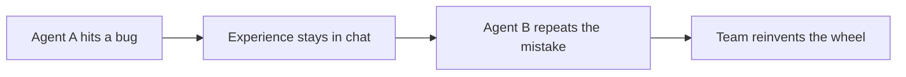
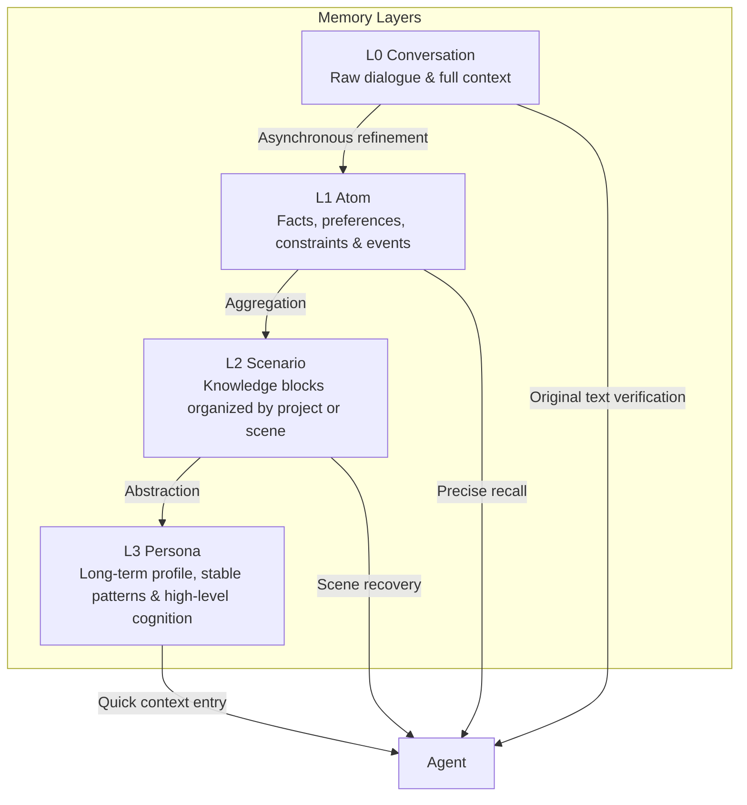
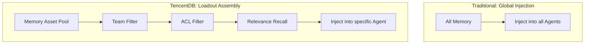
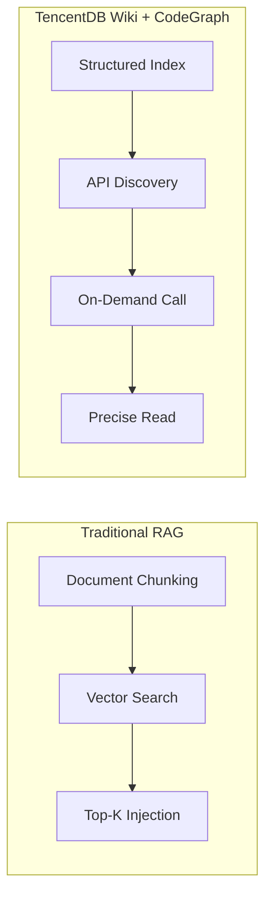
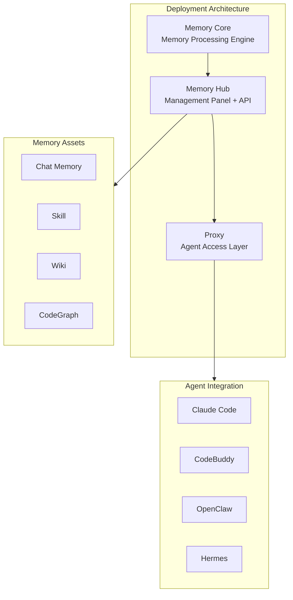
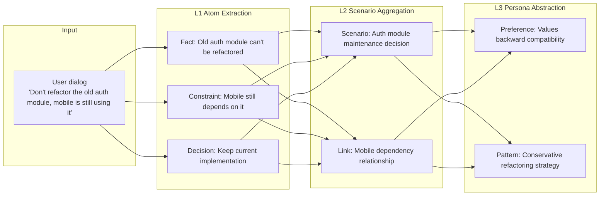
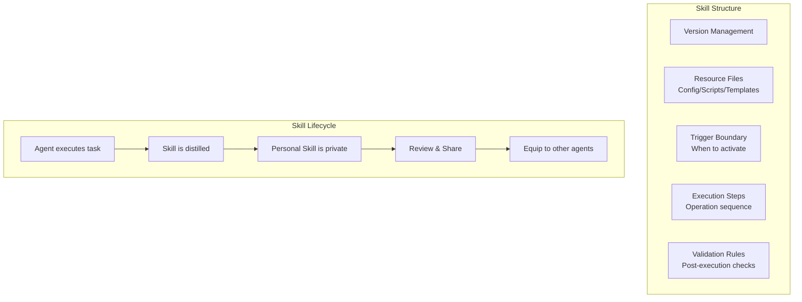

> Project context shouldn't need to be re-explained in every session. Documents shouldn't be re-read from page one. A proven workflow shouldn't be rediscovered from scratch next time.

This quote from the [TencentDB Agent Memory](https://github.com/TencentCloud/TencentDB-Agent-Memory) README hits a core pain point in today's Agent applications: **experience can't be accumulated — every session starts from zero.**

This article breaks down the design philosophy behind TencentDB Agent Memory and how it solves this problem.

## The Core Problem: Agent Amnesia



Most agents work like this: you spend 20 minutes teaching it project context, it completes the task, and the conversation ends. Next session with a different agent — or even the same one — you start over.

TencentDB Agent Memory's solution is straightforward: **turn experience into reusable assets so the next agent can pick up where you left off.**

## Design Philosophy: Three Core Judgments

Before diving into technical details, let's look at three design judgments behind TencentDB Agent Memory. These judgments shaped the entire product:

### Judgment 1: Memory Isn't Flat — It Grows in Layers

Most agent memory solutions store everything flat and recall everything at once. TencentDB chose **layering**:



| Layer | What It Stores | Primary Use | Retrieval Strategy |
|-------|---------------|-------------|-------------------|
| **L0 Conversation** | Raw dialogue & full context | Verify original text, timing, and source | BM25 exact match |
| **L1 Atom** | Facts, preferences, constraints & events | Precise recall of actionable information | Vector search + RRF |
| **L2 Scenario** | Knowledge blocks organized by project or scene | Quickly restore a work context | Semantic search |
| **L3 Persona** | Long-term profile, stable patterns & high-level cognition | Get agents into user/team context | Direct injection |

**Why this design?**

Context windows are a scarce resource. Injecting L0 full conversation every time would explode token consumption. But injecting only L3's highly abstracted profile would lose specific details. Layering allows the system to **recall on demand**: use L2/L3 for quick context entry in daily use, and fall back to L1/L0 via BM25 + vector search + RRF fusion when specific facts are needed.

This is a **precision vs. cost tradeoff**: layering adds indexing and retrieval complexity but significantly reduces per-session token consumption.

### Judgment 2: Memory Isn't a Global Prompt — It's an Agent's Loadout



Traditional approaches dump all memory into the System Prompt — simple but problematic:
- **Token waste**: most memory is irrelevant to the current task
- **Noise interference**: irrelevant information can mislead the agent
- **Privacy leaks**: no granular control over who sees what

TencentDB's Loadout mechanism solves these issues:

| Visibility | Semantics | Use Case |
|-----------|-----------|----------|
| `private` | Only owner can read, team admin excluded | Personal preferences, private decisions |
| `team` | Team members can read, managed by Owner/Admin | Shared docs, public Skills |
| `restricted` | Fine-grained via User/Role/Agent ACL | Sensitive info, role-specific assets |
| `agent` | Targeted assembly for same-team agents | Memory transfer between agents |

**This is a product decision**: TencentDB chose to make "sharing" an explicit action, not a default. New memories are private by default and require active sharing. This aligns with enterprise data security expectations.

### Judgment 3: Knowledge Isn't Injected by the Ton — It's Called on Demand



Traditional RAG chops documents into chunks and returns Top-K fragments. The problem: fragments lose document structure and relationships.

TencentDB's Wiki and CodeGraph use a different strategy:

| Component | Indexing Method | Query Method | Advantage |
|-----------|----------------|-------------|-----------|
| **Wiki** | Structured pages + link graph | `/v3/tools/list` to discover, `/v3/tools/call` to read | Preserves document structure, supports link drill-down |
| **CodeGraph** | Symbols, files, call relationships | callers / callees queries | Supports impact analysis, not just text matching |

**This is a technical tradeoff**: pre-indexing adds build cost (asynchronous processing required), but queries are more precise with lower token consumption.

## Architecture Overview: How the Three Components Work Together



| Component | Responsibility | Key Capabilities |
|-----------|---------------|-----------------|
| **Memory Core** | Memory processing engine | Dialogue refinement (L0→L3), Wiki generation, CodeGraph indexing |
| **Memory Hub** | Management panel + API | Asset CRUD, team/permission management, Agent Loadout assembly |
| **Proxy** | Agent access layer | Unified API interface, adapts to multiple agent frameworks |

Deployment is a one-click startup of all three components:

```bash
git clone https://github.com/Tencent/TencentDB-Agent-Memory.git
cd TencentDB-Agent-Memory/deploy/global-images
cp .env.example .env
$EDITOR .env       # Fill in two sets of LLM params (memory group + proxy group)
./start-all.sh     # One-click start
```

## Four Memory Assets: Deep Dive

### Chat Memory: Layered Memory in Practice

**Core question**: How do you extract structured memory from raw conversations?



**Technical details**:
- L0→L1 extraction: LLM identifies facts, preferences, constraints, and events from conversation
- L1→L2 aggregation: Organizes Atoms into knowledge blocks by topic or scenario
- L2→L3 abstraction: Distills long-term profiles and stable patterns from multiple Scenarios

**Recall strategy**:

```
User question
    ↓
Semantic analysis → Determine which memory layer is needed
    ↓
L2/L3 direct injection (fast context entry)
    ↓
If specific facts are needed
    ↓
BM25 + Vector Search + RRF fusion → Recall L1/L0
    ↓
Limit count + Token budget + Timeout control
    ↓
Inject into Agent context
```

**Why RRF fusion?**

Single retrieval strategies have limitations:
- BM25: Strong exact matching, but can't understand semantics
- Vector search: Strong semantic understanding, but may miss exact keywords
- RRF (Reciprocal Rank Fusion): Combines both rankings, leveraging their complementary strengths

### Skill: Not Just a Prompt — an Executable Unit



**Skill vs. Prompt**:

| Dimension | Prompt | Skill |
|-----------|--------|-------|
| Structure | Plain text | Version + resources + steps + validation |
| Reusability | One-shot | Iterable, rollbackable |
| Controllability | None | Trigger boundaries and validation rules |
| Traceability | None | Version history and usage records |

**Real-world example**:

```yaml
# Release Checklist Skill
version: 2.1
resources:
  - checklist.md
  - rollback-script.sh
trigger:
  when: "agent is about to deploy code"
  confidence: 0.9
steps:
  - Read checklist.md
  - Verify each item
  - If issues found, execute rollback
validation:
  - Check all tests pass
  - Check deployment script is executable
  - Check rollback path exists
```

### Wiki + CodeGraph: Structured Knowledge Graph

**Wiki's design inspiration** comes from Karpathy's [LLM Wiki](https://gist.github.com/karpathy/442a6bf555914893e9891c11519de94f): treating documents as knowledge assets incrementally maintained by LLMs, generating compound interest over time.

```mermaid
flowchart TD
    subgraph "Wiki Construction"
        A["Source Documents<br/>PRD/Design Specs/Operations Manuals"] --> B["LLM Processing"]
        B --> C["Structured Pages"]
        C --> D["Link Graph"]
    end

    subgraph "CodeGraph Construction"
        E["Code Repository"] --> F["AST Parsing"]
        F --> G["Symbol Index"]
        G --> H["Call Relationship Graph"]
    end

    subgraph "Agent Query"
        I["/v3/tools/list"] --> J["Discover available assets"]
        J --> K["/v3/tools/call"]
        K --> L["Read specific page/source code"]
    end
```



**Key differences**:

| Traditional RAG | TencentDB Wiki/CodeGraph |
|----------------|-------------------------|
| Document chunking loses structure | Preserves document structure and link relationships |
| Text matching can't understand call relationships | Indexes symbols, call relationships, and impact paths |
| May return duplicate fragments | Precise reads of specific pages or functions |
| Can't do impact analysis | Can query callers / callees |

**CodeGraph impact analysis in practice**:

```
Agent wants to modify UserService.login()

Traditional RAG:
  Search "UserService login" → returns relevant code snippets
  Agent doesn't know which places call this method

CodeGraph:
  Query UserService.login()'s callers
  Finds: AuthController, SessionManager, TokenService all depend on it
  Agent knows which modules will be affected by this change
```

## Comparison with Industry Solutions

### vs. Mem0

[Mem0](https://github.com/mem0ai/mem0) is another popular agent memory solution.

| Dimension | Mem0 | TencentDB Agent Memory |
|-----------|------|------------------------|
| **Positioning** | General memory layer | Team-level memory hub |
| **Memory structure** | Flat storage | Layered (L0-L3) |
| **Team collaboration** | No native support | Full Team + ACL |
| **Skill management** | None | Versioned Skill assets |
| **Code understanding** | None | CodeGraph call relationships |
| **Deployment complexity** | Low (single service) | Medium (three components) |

**Core difference**: Mem0 suits lightweight memory needs for individuals or small teams; TencentDB is better for enterprise scenarios requiring team collaboration, asset management, and code understanding.

### vs. LangGraph Memory

LangGraph provides a Memory module with conversation history management.

| Dimension | LangGraph Memory | TencentDB Agent Memory |
|-----------|-----------------|------------------------|
| **Memory types** | Conversation history | Four asset types |
| **Storage** | In-memory/Redis/Postgres | Dedicated storage engine |
| **Team collaboration** | Must build yourself | Native support |
| **Knowledge graph** | Needs separate integration | Wiki + CodeGraph built-in |
| **Access control** | Must build yourself | Four-tier visibility + ACL |

**Core difference**: LangGraph Memory is more flexible (customizable storage backend) but requires more development work; TencentDB is more opinionated and works out of the box.

### vs. Zep

[Zep](https://www.getzep.com/) is a commercial agent memory platform.

| Dimension | Zep | TencentDB Agent Memory |
|-----------|-----|------------------------|
| **Deployment** | SaaS / Self-hosted | Self-hosted (open source) |
| **Memory types** | Conversation history + entity extraction | Four asset types |
| **Team collaboration** | Basic support | Full Team + ACL |
| **Cost** | Usage-based pricing | Free (open source) |
| **Data control** | SaaS data in the cloud | Full self-control |

**Core difference**: Zep is a commercial product, ready to use but with costs; TencentDB is open source, requires self-hosting but gives full data control.

## Potential Issues & Room for Improvement

### Current Limitations

| Issue | Impact | Possible Improvement |
|-------|--------|---------------------|
| **Memory extraction credibility is questionable** | Facts/preferences distilled by LLMs may be inaccurate; bad memories get "inherited" | Provenance tracing, confidence scoring, human verification |
| Wiki/CodeGraph async construction | First use requires waiting | Incremental updates, pre-warming |
| CodeGraph prioritizes public repos | Poor private repo experience | SSH credential support, local indexing |
| Memory routing requires manual binding | Not enough automation | Content-based auto-routing |
| Limited cross-framework migration | Vendor lock-in risk | Standardized memory format |

### Memory Credibility: The Overlooked Risk

This issue deserves its own section.

TencentDB Agent Memory relies on LLMs to distill L1 Atoms (facts, preferences, constraints) from conversations. But LLM distillation is **not always trustworthy**:

> An LLM may misread user intent — turning "don't refactor for now" into "never touch this"
>
> An LLM may overgeneralize — treating a one-off preference as a universal rule
>
> An LLM may drop critical context — losing important constraints
>
> An LLM may invent memories that never existed — hallucinations

**Worse**: those incorrect memories can be assembled into other agents, creating "error inheritance." A preference Agent A misunderstood becomes a fact Agent B executes.

The current project doesn't appear to provide:

- Accuracy evaluation for memory extraction
- Provenance tracing (which conversation did this memory come from?)
- Conflict detection (what happens when two memories contradict?)
- Human verification / correction workflows

**What this means**: TencentDB Agent Memory solves "how experience can be accumulated and shared," but not fully "whether the accumulated experience is correct." Users should treat memory assets as less than 100% trustworthy — critical decisions still need human confirmation.

### Design Tradeoffs

**Layered vs. Flat**: Layering adds complexity but reduces query costs. Is this the right tradeoff? It depends on the use case — if agents primarily need fast context entry, layering is worth it; if they frequently query specific facts, layering may add latency.

**Pre-indexed vs. On-demand retrieval**: Pre-indexing adds build cost but queries are more precise. Is this the right tradeoff? It depends on document/codebase size — small repos benefit from pre-indexing; large repos may need smarter incremental updates.

**Private-first vs. Share-first**: Defaulting to private is safer but may slow knowledge flow. Is this the right tradeoff? It depends on enterprise security requirements — strict environments need private-first.

## Benchmark Results

PersonaMem tests whether an agent can correctly understand and apply user information after long-term interaction:

| Benchmark | Without TencentDB Agent Memory | With it | Relative Improvement |
|-----------|------------------------------|---------|---------------------|
| **PersonaMem** | 48% | **76%** | **+59%** |

**Interpretation**:
- The 48% → 76% improvement is significant, showing that memory assets help long-term interaction
- But 76% still means 24% of cases where the agent can't correctly understand user information
- Possible reasons: memory extraction isn't precise enough, recall strategy isn't smart enough, or memory granularity is suboptimal

## When Should You Use It?

The key question isn't team size — it's **whether you need these capabilities**:

| Required Capability | Recommended Approach |
|--------------------|---------------------|
| Cross-session memory, experience accumulation | RAG + simple memory management |
| Multi-agent memory sharing and isolation | TencentDB Agent Memory |
| Memory asset versioning and review | TencentDB Agent Memory |
| Fine-grained access control (ACL) | TencentDB Agent Memory |
| Structured code understanding (call relationships, impact analysis) | TencentDB Agent Memory |
| Document knowledge graph (preserving structure and links) | TencentDB Agent Memory |

**Specific scenarios**:

| Scenario | Recommended Approach | Reason |
|----------|--------------------|--------|
| Personal agent assistant | Lightweight RAG + local memory | Simple, no maintenance |
| Enterprise agent platform, no cross-agent sharing needed | RAG + custom development | Big companies use RAG too, it depends on needs |
| Multi-role agent collaboration with memory isolation and sharing | TencentDB Agent Memory | Native Team + ACL support |
| Knowledge-intensive project requiring code impact analysis | TencentDB Agent Memory | CodeGraph provides structured indexing |
| Skill reuse and version management needed | TencentDB Agent Memory | Skill is a complete executable unit |

## Summary

TencentDB Agent Memory's core value:

1. **Experience as assets**: Turn conversations, documents, and code into reusable Chat Memory, Skill, Wiki, and CodeGraph
2. **Layered storage**: L0→L3 progressive refinement, BM25 + vector + RRF fusion recall, balancing precision and cost
3. **Precise assembly**: Fixed Binding + ACL, load memory by role and need, control noise and privacy
4. **Team collaboration**: Share experience, not privacy, with version management and asset review

This solution addresses a real pain point: **how to let agent teams continuously accumulate experience, instead of starting from zero every time**.

But it comes with costs: higher architectural complexity and operational overhead. Whether to use it depends on whether your scenario truly needs team-level memory management.

---

## References

- [TencentDB Agent Memory GitHub](https://github.com/TencentCloud/TencentDB-Agent-Memory) — Project homepage (⭐ 20.8k)
- [INSTALL.md](https://github.com/TencentCloud/TencentDB-Agent-Memory/blob/feat/server_team/INSTALL_CN.md) — Installation guide
- [ROADMAP.md](https://github.com/TencentCloud/TencentDB-Agent-Memory/blob/feat/server_team/ROADMAP_CN.md) — Project roadmap
- [CONTRIBUTING.md](https://github.com/TencentCloud/TencentDB-Agent-Memory/blob/feat/server_team/CONTRIBUTING_CN.md) — Contribution guide
- [CodeGraph](https://github.com/colbymchenry/codegraph) — Upstream project for CodeGraph asset module
- [Andrej Karpathy's LLM Wiki](https://gist.github.com/karpathy/442a6bf555914893e9891c11519de94f) — Design inspiration for Wiki layer
- [Mem0](https://github.com/mem0ai/mem0) — General agent memory layer
- [Zep](https://www.getzep.com/) — Commercial agent memory platform

### Attribution

Images and data cited in this article come from the official TencentDB Agent Memory README and have been checked against the source.
